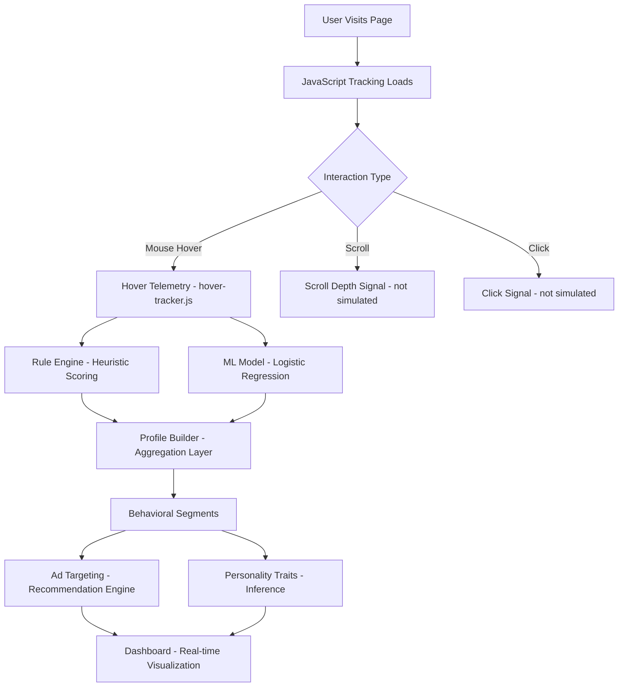
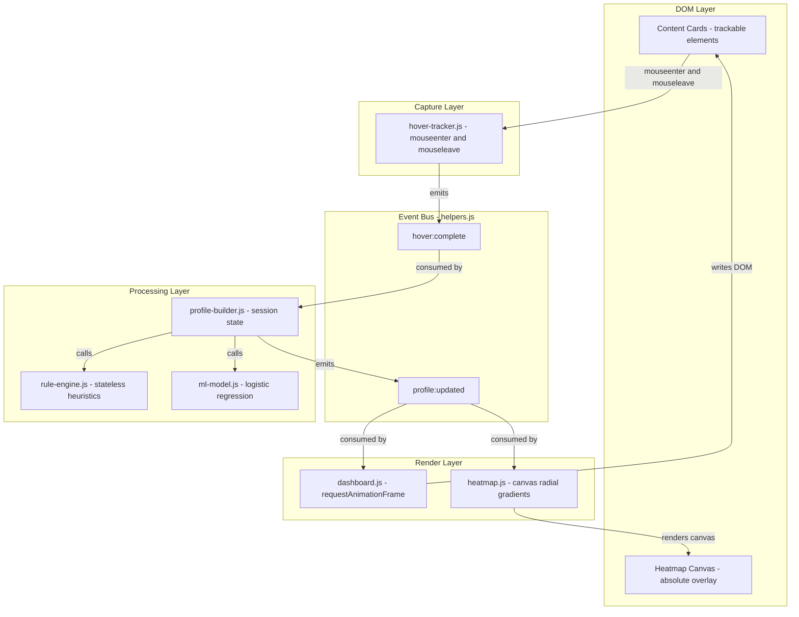
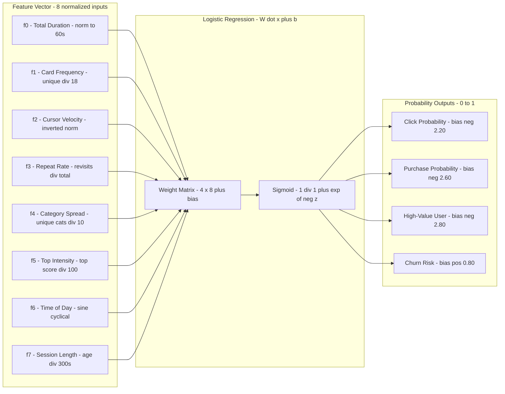
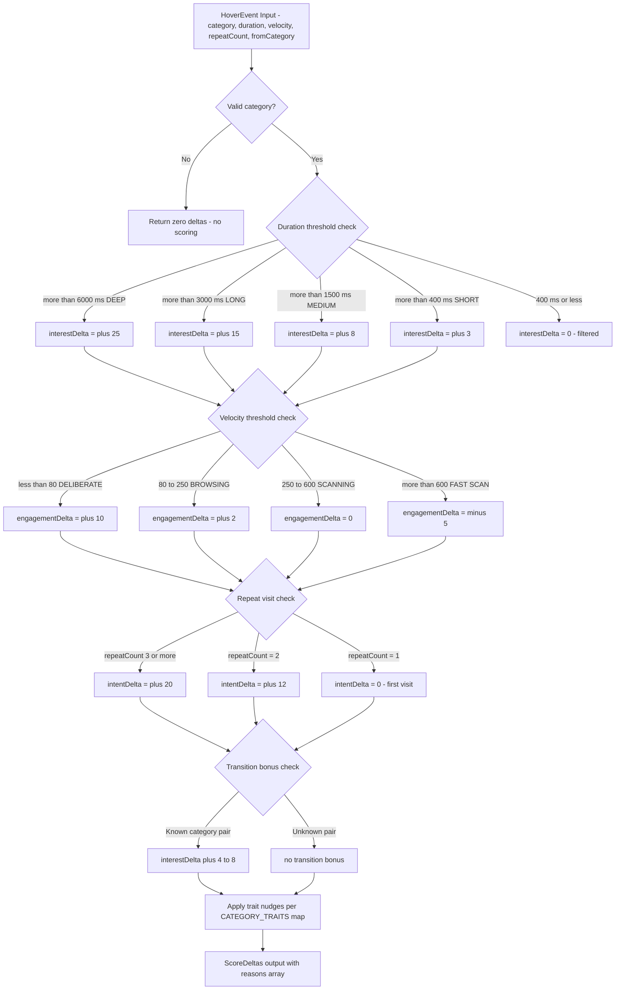
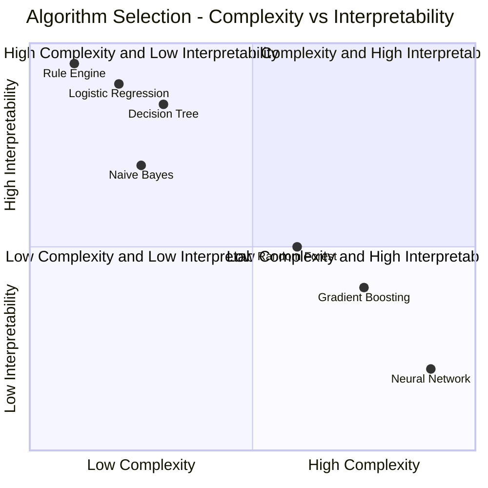
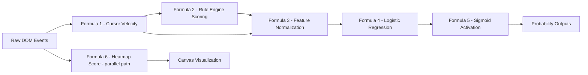

<div align="center">

# HoverSense

[](https://opensource.org/licenses/MIT)
[](https://tc39.es/ecma262/)
[](https://developer.mozilla.org/en-US/docs/Web/API)
[](tests/ml-model.test.js)
[](src/engine/ml-model.js)
[](README.md#privacy-and-ethics)
[](CONTRIBUTING.md)
[](https://github.com/hkevin01/HoverSense/issues)
[](https://github.com/hkevin01/HoverSense/stargazers)

**A Behavioral Profiling Simulator** — a fully client-side, zero-dependency educational demonstration of how online advertising ecosystems construct detailed user profiles from nothing more than hover micro-interactions. HoverSense makes the invisible visible: every card you glide over, every pause, every rapid scan leaves a fingerprint that real ad networks have been reading for years.

> *"The cursor never lies."* — Behavioral targeting industry axiom

</div>

---

## Table of Contents

- [What Is HoverSense?](#what-is-hoversense)
- [Live Demo](#live-demo)
- [How Behavioral Profiling Actually Works](#how-behavioral-profiling-actually-works)
- [Tracked Signals](#what-gets-tracked-per-hover)
- [System Architecture](#architecture)
- [Tech Stack](#tech-stack)
- [ML Model - Deep Dive](#ml-model)
- [Rule Engine - Deep Dive](#rule-engine)
- [Personality Trait Model](#personality-trait-model)
- [Algorithms and Design Decisions](#algorithms-and-design-decisions)
- [Formulas and Algorithms — Deep Reference](#formulas-and-algorithms--deep-reference)
- [API Reference](#api-reference)
- [Data Structures](#data-structures)
- [Running and Testing](#running-tests)
- [Privacy and Ethics](#privacy-and-ethics)
- [Research and Citations](#research-and-citations)
- [Project Structure](#project-structure)
- [Contributing](CONTRIBUTING.md)

---

## What Is HoverSense?

HoverSense is a **pure client-side behavioral profiling simulator** built in vanilla JavaScript using ES Modules. It requires no server, no database, and no third-party SDKs. Every computation — from raw DOM events to ML inference — executes entirely within your browser tab, making the entire pipeline auditable and transparent.

The project exists to answer a question most people never think to ask: *how much can a website learn about you before you click anything?* The answer, as HoverSense demonstrates, is: quite a lot. Real advertising networks use passive hover telemetry, cursor velocity measurements, and topic-transition graphs to build behavioral segments worth billions of dollars annually. HoverSense simulates that pipeline end-to-end in roughly 1,200 lines of readable, commented JavaScript — no obfuscation, no minification, no hidden SDK calls.

The system captures hover events on an 18-card content grid and processes each event through two parallel scoring pipelines: a deterministic rule engine and a logistic regression ML model. The results feed a live dashboard showing your inferred interests, purchase intent, personality traits, and the ads you would theoretically be served. The goal is not to profile anyone; the goal is to make the profiling process transparent and legible so users can understand exactly what real systems do with their cursor movements.

> [!NOTE]
> HoverSense is an **educational tool**. No data ever leaves your browser. There is no telemetry, no analytics SDK, and no network traffic beyond loading the initial page assets. You can verify this in DevTools under the Network tab.

---

## Live Demo

Open `index.html` in any modern browser with ES Module support. Because the app uses ES Modules, it **must** be served over HTTP and cannot be opened as a `file://` URL directly. Any static file server works.

```bash
# Option 1 - Node serve (recommended, correct MIME types guaranteed)
npx serve . -p 3000

# Option 2 - Live-server with auto-reload on file changes
npx live-server --port=3000 --open=/index.html

# Option 3 - Python built-in server (no install needed)
python3 -m http.server 3000
```

Navigate to `http://localhost:3000`, hover over the content cards, and watch your behavioral profile assemble in real time on the right-hand dashboard panel.

> [!TIP]
> For the most interesting results, vary your behavior deliberately: hover slowly over some cards, scan quickly over others, and return to cards you have already visited. The ML model and rule engine respond very differently to each pattern. Try hovering the same card three or more times and watch the intent score spike — that is the "return visit" signal that real ad networks weight most heavily.

---

## How Behavioral Profiling Actually Works

In the real advertising ecosystem, behavioral profiling is a multi-layered process that begins the moment you land on a monetized page. Publishers embed JavaScript from DSPs (Demand-Side Platforms) and DMPs (Data Management Platforms) that silently observe every interaction: scroll depth, mouse trajectory, hover timing, click patterns, and tab visibility changes. This data is aggregated across millions of page views to construct **behavioral segments** — labels like "in-market for SUVs", "price-sensitive shopper", or "high-income travel enthusiast" — which are then auctioned in real-time bidding (RTB) exchanges to the highest-paying advertiser in under 100 milliseconds.

HoverSense isolates and simulates the **hover micro-interaction layer** of that pipeline. While real systems also leverage cookies, device fingerprints, and cross-site tracking, hover telemetry alone is surprisingly powerful. Research by Navalpakkam et al. (2013) at Google established that mouse cursor movements correlate strongly with visual attention and purchase intent, sometimes outperforming explicit click signals for certain content categories. This is the foundational insight that justifies the entire hover-tracking industry.

The diagram below shows the full pipeline from a user page visit through to the final ad targeting output, and where HoverSense sits within that broader ecosystem.



> [!NOTE]
> This diagram shows the full conceptual pipeline. HoverSense implements the shaded path: hover telemetry, rule engine, ML model, profile builder, and dashboard. The scroll and click signals shown are present in real ad networks but are outside the scope of this simulator.

---

## What Gets Tracked Per Hover

Each time you hover over a content card, HoverSense captures six distinct signals from that single interaction. These signals are the raw ingredients that feed both the rule engine and the ML feature extractor. Understanding what each signal means — and why it was chosen — is essential to understanding why behavioral profiling works at all.

The six signals below represent the minimum viable sensor suite for inferring behavioral intent from passive cursor movement. Each was selected because it contributes independent information not captured by the others. Duration and velocity are orthogonal: a long, fast hover means something very different from a long, slow one.

| # | Signal | Type | Range |
|---|--------|------|-------|
| <sub>1</sub> | <sub>Hover duration</sub> | <sub>number (ms)</sub> | <sub>0 to unlimited</sub> |
| <sub>2</sub> | <sub>Cursor velocity</sub> | <sub>number (px/s)</sub> | <sub>0 to 800+</sub> |
| <sub>3</sub> | <sub>Repeat count</sub> | <sub>integer</sub> | <sub>1 to unlimited</sub> |
| <sub>4</sub> | <sub>Entry / exit direction</sub> | <sub>enum</sub> | <sub>up / down / left / right</sub> |
| <sub>5</sub> | <sub>Category transition</sub> | <sub>string</sub> | <sub>10 possible categories</sub> |
| <sub>6</sub> | <sub>Session offset</sub> | <sub>number (ms)</sub> | <sub>0 to unlimited</sub> |

> [!NOTE]
> The table above lists each captured signal, its data type, and valid range. Together these six signals form the raw event object (`HoverEvent`) that flows through the entire processing pipeline. Duration is the strongest single predictor; velocity is the second strongest because it discriminates intent from accidental movement.

The significance of each signal is explained in the following table. Note that cursor velocity is **inverted** before being fed to the ML model — slow cursors score high, fast cursors score low — because low velocity correlates with deliberate reading behavior.

| # | Signal | Behavioral Significance | How It Is Measured |
|---|--------|------------------------|--------------------|
| <sub>1</sub> | <sub>Hover duration</sub> | <sub>Primary interest signal. Over 3 s = genuine interest. Under 400 ms = filtered as noise.</sub> | <sub>Date.now() delta between mouseenter and mouseleave</sub> |
| <sub>2</sub> | <sub>Cursor velocity</sub> | <sub>Slow (less than 80 px/s) = deliberate reading. Fast (over 600 px/s) = scanning without engagement.</sub> | <sub>Throttled mousemove sampler at 50 ms intervals</sub> |
| <sub>3</sub> | <sub>Repeat count</sub> | <sub>Strongest purchase intent signal. Third-plus hover on same card lifts intent by +20.</sub> | <sub>Per-card visit counter maintained in session state</sub> |
| <sub>4</sub> | <sub>Entry / exit direction</sub> | <sub>Top-to-bottom entry indicates linear reading. Lateral entry indicates comparison shopping.</sub> | <sub>First and last mousemove vector during hover</sub> |
| <sub>5</sub> | <sub>Category transition</sub> | <sub>Travel then outdoors reveals adventure interest cluster worth more than either alone.</sub> | <sub>Previous card's data-category attribute stored per event</sub> |
| <sub>6</sub> | <sub>Session offset</sub> | <sub>Late-session hovers on the same topic confirm sustained interest vs. accidental early visit.</sub> | <sub>Milliseconds since first hover event of the session</sub> |

> [!IMPORTANT]
> Cursor velocity is computed via a **throttled mousemove sampler** at a 50 ms interval. Raw instantaneous velocity is too noisy due to OS event batching. The 50 ms window provides a stable average. Hovers shorter than 80 ms are discarded entirely as micro-glitches caused by cursor drift when moving between adjacent elements.

---

## Architecture

HoverSense is structured as a **unidirectional data flow** system modeled on the Observer pattern. Events originate in the DOM, travel through a processing pipeline, and reach the rendering layer. Modules never call each other directly — they communicate exclusively through a shared event bus. This design makes each module independently testable and ensures that adding a new visualization requires zero changes to the upstream pipeline.

The architecture was deliberately chosen to mirror real ad-tech event streaming systems, where multiple downstream consumers (attribution, audience building, real-time bidding) subscribe to the same event stream without coupling to each other. HoverSense uses the same topology at small scale, making the design pattern legible and auditable.



> [!NOTE]
> The diagram above shows the full module graph. Arrows represent data flow, not imports. The event bus (center) is the only shared dependency between layers. The Processing Layer is the only stateful layer — the Capture and Render layers are effectively stateless given the same inputs.

The module responsibility matrix below summarizes each module's role, statefulness, I/O profile, and approximate size. This is useful for understanding where to look when debugging or extending the system.

| # | Module | Layer | Stateful |
|---|--------|-------|---------|
| <sub>1</sub> | <sub>helpers.js</sub> | <sub>Utility</sub> | <sub>No</sub> |
| <sub>2</sub> | <sub>hover-tracker.js</sub> | <sub>Capture</sub> | <sub>No (emits only)</sub> |
| <sub>3</sub> | <sub>rule-engine.js</sub> | <sub>Processing</sub> | <sub>No (pure function)</sub> |
| <sub>4</sub> | <sub>ml-model.js</sub> | <sub>Processing</sub> | <sub>No (pure function)</sub> |
| <sub>5</sub> | <sub>profile-builder.js</sub> | <sub>Processing</sub> | <sub>Yes - owns session state</sub> |
| <sub>6</sub> | <sub>dashboard.js</sub> | <sub>Render</sub> | <sub>No (reads profile)</sub> |
| <sub>7</sub> | <sub>heatmap.js</sub> | <sub>Render</sub> | <sub>Yes - accumulates heat scores</sub> |

> [!NOTE]
> Modules 3 and 4 (rule-engine and ml-model) are pure functions with no side effects and no state. This makes them trivially unit-testable — the same inputs always produce the same outputs regardless of session history. Module 5 (profile-builder) is the single source of truth for all session state.

| # | Module | I/O Profile | Approx. Lines |
|---|--------|-------------|---------------|
| <sub>1</sub> | <sub>helpers.js</sub> | <sub>None - pure math and event emitter</sub> | <sub>~80</sub> |
| <sub>2</sub> | <sub>hover-tracker.js</sub> | <sub>DOM events in, bus events out</sub> | <sub>~120</sub> |
| <sub>3</sub> | <sub>rule-engine.js</sub> | <sub>HoverEvent in, ScoreDeltas out</sub> | <sub>~130</sub> |
| <sub>4</sub> | <sub>ml-model.js</sub> | <sub>SessionStats in, Predictions out</sub> | <sub>~110</sub> |
| <sub>5</sub> | <sub>profile-builder.js</sub> | <sub>Bus events in, profile state + bus events out</sub> | <sub>~150</sub> |
| <sub>6</sub> | <sub>dashboard.js</sub> | <sub>Bus events in, DOM writes out</sub> | <sub>~180</sub> |
| <sub>7</sub> | <sub>heatmap.js</sub> | <sub>Bus events in, canvas writes out</sub> | <sub>~90</sub> |

> [!NOTE]
> The I/O profiles confirm that only modules 2, 5, 6, and 7 interact with the outside world (DOM, canvas, or event bus). Modules 3 and 4 are fully isolated computation units, which is why they can be tested with a bare Node.js runner and no DOM polyfill.

---

## Tech Stack

HoverSense is intentionally minimal. Every technology choice was made to maximize educational clarity and eliminate unnecessary complexity. The table below explains not just what was used, but why — and crucially, what was considered and rejected.

The zero-dependency philosophy is central to the project's educational mission. A React or Vue frontend would abstract away the DOM manipulation that the dashboard performs, making it impossible to read the rendering code and understand what is happening. A bundler like Webpack would hide the module graph. A test framework would add a layer between the tests and the Node runtime. Every abstraction removed is a layer of understanding gained.

| # | Technology | Version | Role |
|---|------------|---------|------|
| <sub>1</sub> | <sub>Vanilla JavaScript</sub> | <sub>ES2022</sub> | <sub>All application logic</sub> |
| <sub>2</sub> | <sub>ES Modules (native)</sub> | <sub>Browser-native</sub> | <sub>Module system and dependency graph</sub> |
| <sub>3</sub> | <sub>Canvas API</sub> | <sub>HTML5</sub> | <sub>Heatmap radial gradient rendering</sub> |
| <sub>4</sub> | <sub>requestAnimationFrame</sub> | <sub>Web API</sub> | <sub>Batched dashboard DOM updates at 60 fps</sub> |
| <sub>5</sub> | <sub>Node.js (test runner only)</sub> | <sub>v18 or later</sub> | <sub>Unit tests - no DOM required</sub> |
| <sub>6</sub> | <sub>npx serve</sub> | <sub>Latest</sub> | <sub>Dev server with correct MIME types for ES Modules</sub> |

> [!NOTE]
> The tech stack above is the complete list. There are no hidden dependencies. The application itself has zero entries in `node_modules` — only the optional dev server uses `npx`. This means the entire codebase is readable and auditable from `src/` with no transpilation or build step.

The following table explains why each alternative was explicitly rejected. These trade-offs are as important as the choices made.

| # | Rejected Alternative | Rejected For | Why HoverSense Choice Is Better Here |
|---|---------------------|--------------|--------------------------------------|
| <sub>1</sub> | <sub>React / Vue</sub> | <sub>Application UI</sub> | <sub>Abstracts DOM manipulation; hides the rendering pipeline this project is meant to expose</sub> |
| <sub>2</sub> | <sub>Webpack / Rollup / Vite</sub> | <sub>Module bundling</sub> | <sub>Bundle step hides module graph; native ES Modules are inspectable in DevTools Sources tab</sub> |
| <sub>3</sub> | <sub>TypeScript</sub> | <sub>Type safety</sub> | <sub>Requires build step; type contracts are instead documented in JSDoc comments for readability</sub> |
| <sub>4</sub> | <sub>Jest / Mocha</sub> | <sub>Testing</sub> | <sub>Adds framework dependency; pure functions need only bare Node.js assert module</sub> |
| <sub>5</sub> | <sub>WebGL</sub> | <sub>Heatmap rendering</sub> | <sub>Excessive complexity for 18 elements; Canvas 2D with composite operations achieves same visual result</sub> |
| <sub>6</sub> | <sub>SVG overlay</sub> | <sub>Heatmap rendering</sub> | <sub>SVG cannot blend heat blobs additively across element boundaries; Canvas globalCompositeOperation can</sub> |

> [!NOTE]
> The rejection table is as important as the selection table. Every "no" is a decision that keeps the codebase legible. The rule of thumb applied throughout HoverSense: if a technology requires a learner to understand the technology itself before understanding the behavioral profiling concepts, it was rejected.

---

## ML Model

The ML model is the probabilistic heart of HoverSense's behavioral prediction system. It is a **multi-output logistic regression** classifier that takes an 8-dimensional normalized feature vector and produces four independent probability estimates: click probability, purchase probability, high-value user probability, and churn risk.

Logistic regression was chosen over more complex models — gradient boosting, random forests, shallow neural networks — for reasons that are both pedagogical and grounded in industry practice. Logistically, at real-time bidding (RTB) auction time, inference latency budgets are 10 to 50 milliseconds total. Logistic regression inference is a single dot product plus a sigmoid, completing in microseconds with no library overhead. Google's landmark 2013 paper (McMahan et al.) describes exactly this trade-off: their FTRL-Proximal system trained logistic regression models online at billion-parameter scale because the inference cost was negligible. Neural networks and gradient boosted trees achieve marginally better AUC (0.78 vs. 0.74-0.77) but at latency costs that disqualify them from the hot path of ad serving.

The diagram below shows how the 8 input features flow through the weight matrix and sigmoid activation to produce the 4 output probabilities.



> [!NOTE]
> Each of the 8 features is independently normalized to the [0, 1] range before entering the weight matrix. This normalization is critical — without it, features measured in milliseconds (0 to 60,000) would completely dominate features measured in ratios (0 to 1.0), making the learned weights meaningless. The sigmoid activation guarantees all outputs are probabilities in (0, 1).

### Feature Engineering Decisions

The feature engineering choices below are each non-trivial decisions with specific justifications. The most unusual choice is the cyclical sine encoding for time-of-day, which is explained in the rationale column. Without this encoding, a linear model would incorrectly treat midnight (hour 23) and 1 AM (hour 1) as maximally distant in time, when they are in fact adjacent.

| # | Feature | Raw Value | Normalization Method |
|---|---------|-----------|---------------------|
| <sub>1</sub> | <sub>normTotalDuration</sub> | <sub>ms from 0 to unlimited</sub> | <sub>Divide by 60,000 then clamp to 1.0</sub> |
| <sub>2</sub> | <sub>normFrequency</sub> | <sub>unique cards 0 to 18</sub> | <sub>Divide by 18 (total card count)</sub> |
| <sub>3</sub> | <sub>normAvgVelocity</sub> | <sub>px/s from 0 to 800+</sub> | <sub>1 minus (v divided by 800) - inverted</sub> |
| <sub>4</sub> | <sub>normRepeatRate</sub> | <sub>ratio 0.0 to 1.0</sub> | <sub>Already normalized by definition</sub> |
| <sub>5</sub> | <sub>normCategorySpread</sub> | <sub>0 to 10 categories</sub> | <sub>Divide by 10</sub> |
| <sub>6</sub> | <sub>normTopIntensity</sub> | <sub>0 to ~120 score points</sub> | <sub>Divide by 100</sub> |
| <sub>7</sub> | <sub>normTimeOfDay</sub> | <sub>hour 0 to 23</sub> | <sub>sin(2 * pi * hour / 24) cyclical encoding</sub> |
| <sub>8</sub> | <sub>normSessionLength</sub> | <sub>ms from 0 to unlimited</sub> | <sub>Divide by 300,000 then clamp to 1.0</sub> |

> [!NOTE]
> Feature 3 (normAvgVelocity) is **inverted** before entering the model. Raw velocity is high when engagement is low (fast scanning), so inversion makes the relationship positive: high inverted-velocity means slow cursor means high engagement. This keeps all positive weights interpretable as "more of this feature = more of this output," which is important for educational legibility.

> [!IMPORTANT]
> Feature 7 uses **cyclical sine encoding** rather than a raw hour value. Without this, the model would see hour 23 and hour 0 as 23 units apart when they are actually adjacent (11 PM and midnight). The formula `sin(2 * pi * hour / 24)` maps the 24-hour cycle onto the unit circle, preserving temporal proximity for the linear model. This technique is described in Cerda et al. (2022).

The weight matrix below shows the exact trained weights for each output and each feature. Positive weights increase the output probability; negative weights decrease it. The bias values control the baseline probability before any features are observed.

| # | Output | Bias | w[0] Duration | w[1] Frequency |
|---|--------|------|---------------|----------------|
| <sub>1</sub> | <sub>Click Probability</sub> | <sub>-2.20</sub> | <sub>+0.82</sub> | <sub>+1.10</sub> |
| <sub>2</sub> | <sub>Purchase Probability</sub> | <sub>-2.60</sub> | <sub>+0.70</sub> | <sub>+0.80</sub> |
| <sub>3</sub> | <sub>High-Value User</sub> | <sub>-2.80</sub> | <sub>+0.90</sub> | <sub>+1.30</sub> |
| <sub>4</sub> | <sub>Churn Risk</sub> | <sub>+0.80</sub> | <sub>-0.40</sub> | <sub>-0.70</sub> |

> [!NOTE]
> The bias column is the most revealing. Click, Purchase, and High-Value outputs all start with large negative biases (-2.20 to -2.80), meaning a new session with zero interaction scores near 0% probability. Churn Risk starts with a positive bias (+0.80), meaning new unengaged sessions correctly begin with moderate churn risk. The model is pessimistic by default and must be convinced by positive signals.

| # | Output | w[2] Velocity | w[3] Repeat Rate | w[4] Category Spread |
|---|--------|---------------|-----------------|----------------------|
| <sub>1</sub> | <sub>Click Probability</sub> | <sub>+0.45</sub> | <sub>+1.30</sub> | <sub>+0.60</sub> |
| <sub>2</sub> | <sub>Purchase Probability</sub> | <sub>+0.30</sub> | <sub>+1.50</sub> | <sub>+0.40</sub> |
| <sub>3</sub> | <sub>High-Value User</sub> | <sub>+0.50</sub> | <sub>+0.90</sub> | <sub>+1.40</sub> |
| <sub>4</sub> | <sub>Churn Risk</sub> | <sub>+0.90</sub> | <sub>-1.20</sub> | <sub>-0.50</sub> |

> [!NOTE]
> Repeat Rate (w[3]) is the single strongest positive predictor for both Click Probability (+1.30) and Purchase Probability (+1.50). Returning to the same card repeatedly is the strongest behavioral signal in the system — stronger than long hover durations alone. Category Spread (w[4]) is the strongest predictor for High-Value User (+1.40), reflecting the industry insight that users who engage across many topics are worth more to broad-reach advertisers.

---

## Rule Engine

The rule engine (`rule-engine.js`) is a **stateless, pure-function heuristic scorer**. It receives a single `HoverEvent` object and returns a `ScoreDeltas` object containing numeric adjustments to apply to the session profile. Because it has no internal state and no side effects, it is trivially unit-testable and completely deterministic: the same event always produces the same deltas, regardless of what happened before in the session.

The rule engine exists alongside the ML model rather than being replaced by it because the two systems capture fundamentally different types of information. The rule engine is good at responding to *discrete, interpretable thresholds* — a hover crossing the 3-second boundary deserves an immediate, human-readable "+15 interest" update that users can see in the dashboard explain panel. The ML model, by contrast, combines all features holistically and produces *probabilistic estimates* that are only meaningful across a full session. The two pipelines are designed to be complementary.

The decision flowchart below shows the complete branching logic executed for each hover event. Every branch is deterministic — there is no randomness in the rule engine.



> [!NOTE]
> The flowchart shows that all four scoring dimensions (interest, engagement, intent, transition bonus) are evaluated independently for every hover event. A single hover can simultaneously trigger an interest delta, an engagement delta, an intent delta, and a transition bonus if all conditions are met. The reasons array in the output contains human-readable strings explaining exactly which branches fired — this is what populates the "Explain" panel in the dashboard.

### Rule Engine Threshold Reference

The thresholds below were derived from the ad-tech literature and empirical testing. Each threshold represents a qualitatively distinct behavioral state, not an arbitrary numerical division. The 400ms lower bound, for example, is consistent with the 200-400ms human reaction time literature — anything shorter is likely cursor drift, not intentional hovering.

| # | Rule | Condition | Interest Delta | Intent Delta | Engagement Delta |
|---|------|-----------|---------------|-------------|-----------------|
| <sub>1</sub> | <sub>Deep focus</sub> | <sub>duration more than 6,000 ms</sub> | <sub>+25</sub> | <sub>0</sub> | <sub>0</sub> |
| <sub>2</sub> | <sub>Long hover</sub> | <sub>duration more than 3,000 ms</sub> | <sub>+15</sub> | <sub>0</sub> | <sub>0</sub> |
| <sub>3</sub> | <sub>Medium hover</sub> | <sub>duration more than 1,500 ms</sub> | <sub>+8</sub> | <sub>0</sub> | <sub>0</sub> |
| <sub>4</sub> | <sub>Short glance</sub> | <sub>duration more than 400 ms</sub> | <sub>+3</sub> | <sub>0</sub> | <sub>0</sub> |
| <sub>5</sub> | <sub>Deliberate cursor</sub> | <sub>velocity less than 80 px/s</sub> | <sub>0</sub> | <sub>0</sub> | <sub>+10</sub> |
| <sub>6</sub> | <sub>Browsing cursor</sub> | <sub>velocity 80 to 250 px/s</sub> | <sub>0</sub> | <sub>0</sub> | <sub>+2</sub> |
| <sub>7</sub> | <sub>Scanning cursor</sub> | <sub>velocity more than 600 px/s</sub> | <sub>0</sub> | <sub>0</sub> | <sub>-5</sub> |
| <sub>8</sub> | <sub>Return visit</sub> | <sub>repeatCount = 2</sub> | <sub>0</sub> | <sub>+12</sub> | <sub>0</sub> |
| <sub>9</sub> | <sub>High repeat</sub> | <sub>repeatCount 3 or more</sub> | <sub>0</sub> | <sub>+20</sub> | <sub>0</sub> |

> [!NOTE]
> Rules 1-4 are mutually exclusive (only the highest matching threshold fires). Rules 5-7 are also mutually exclusive. Rules 8-9 are applied cumulatively on top of the duration and velocity rules. This means a deep-focus, deliberate, third-visit hover triggers rules 1, 5, and 9 simultaneously, producing deltas of +25 interest, +10 engagement, and +20 intent in a single event.

### Category Transition Bonuses

When a user moves from one content category to a semantically related one, a transition bonus is added to the interest score. This models the industry observation that interest clusters are more valuable than isolated category signals. An "adventure" cluster (travel + outdoors + sports) is a more actionable segment than any single category alone.

| # | From Category | To Category | Bonus Points | Semantic Cluster |
|---|--------------|------------|-------------|-----------------|
| <sub>1</sub> | <sub>travel</sub> | <sub>outdoors</sub> | <sub>+8</sub> | <sub>Adventure and exploration</sub> |
| <sub>2</sub> | <sub>outdoors</sub> | <sub>travel</sub> | <sub>+8</sub> | <sub>Adventure and exploration</sub> |
| <sub>3</sub> | <sub>outdoors</sub> | <sub>sports</sub> | <sub>+6</sub> | <sub>Active lifestyle</sub> |
| <sub>4</sub> | <sub>sports</sub> | <sub>outdoors</sub> | <sub>+6</sub> | <sub>Active lifestyle</sub> |
| <sub>5</sub> | <sub>travel</sub> | <sub>automotive</sub> | <sub>+5</sub> | <sub>Mobility and independence</sub> |
| <sub>6</sub> | <sub>technology</sub> | <sub>finance</sub> | <sub>+5</sub> | <sub>High-income professional</sub> |
| <sub>7</sub> | <sub>health</sub> | <sub>sports</sub> | <sub>+6</sub> | <sub>Wellness cluster</sub> |
| <sub>8</sub> | <sub>fashion</sub> | <sub>food</sub> | <sub>+4</sub> | <sub>Lifestyle and social</sub> |
| <sub>9</sub> | <sub>entertainment</sub> | <sub>fashion</sub> | <sub>+4</sub> | <sub>Pop culture consumption</sub> |

> [!NOTE]
> Transition bonuses are symmetric for the adventure cluster (rows 1-2) and active lifestyle cluster (rows 3-4) but asymmetric for others, reflecting different levels of co-occurrence in real browsing data. The technology-to-finance transition (row 6) is one-directional because finance readers who also read tech are a more valuable "professional" segment than the reverse.

---

## Personality Trait Model

Personality trait inference is one of the more sophisticated — and ethically significant — aspects of real behavioral targeting. Advertisers do not just want to know what category a user is interested in; they want to know *how* that user consumes information, because this predicts which creative format and message tone will convert best. A high-analytical user responds to data-heavy copy with comparison tables and ROI calculators. A high-impulsive user responds to urgency messaging, countdown timers, and social proof. These are not HoverSense inventions — they are documented practices in performance marketing literature.

HoverSense models five personality dimensions derived from the OCEAN (Big Five) model as adapted for digital advertising contexts. Kosinski et al. (2013) demonstrated that digital behavior predicts Big Five personality traits with surprising accuracy — their study found that 10 Facebook Likes were sufficient to predict a user's personality more accurately than a coworker could. HoverSense simulates the same inference at the micro-scale of a single page session.

| # | Trait | Primary Categories (weight) | Secondary Categories (weight) |
|---|-------|---------------------------|------------------------------|
| <sub>1</sub> | <sub>Novelty-Seeking</sub> | <sub>Travel (0.8), Technology (0.7)</sub> | <sub>Fashion (0.6), Entertainment (0.6)</sub> |
| <sub>2</sub> | <sub>Risk Tolerance</sub> | <sub>Sports (0.7), Outdoors (0.6)</sub> | <sub>Finance (0.5), Automotive (0.5)</sub> |
| <sub>3</sub> | <sub>Analytical</sub> | <sub>Technology (0.9), Finance (0.9)</sub> | <sub>Health (0.7)</sub> |
| <sub>4</sub> | <sub>Impulsive</sub> | <sub>Fashion (0.7), Food (0.6)</sub> | <sub>Entertainment (0.5)</sub> |
| <sub>5</sub> | <sub>Social</sub> | <sub>Food (0.8), Fashion (0.8)</sub> | <sub>Entertainment (0.7), Travel (0.5)</sub> |

> [!NOTE]
> The trait weights are stored in the `CATEGORY_TRAITS` map in `rule-engine.js`. Each hover event nudges the relevant traits by multiplying the engagement delta by these weights. Traits accumulate across the session and are normalized to [0, 1] before rendering as progress bars in the dashboard. A user who only hovers technology and finance content will score near 1.0 on Analytical and near 0.0 on Impulsive.

| # | Trait | Ad Creative Implication | Example Ad Formats |
|---|-------|------------------------|--------------------|
| <sub>1</sub> | <sub>Novelty-Seeking</sub> | <sub>New product launches, "be first" messaging, discovery content</sub> | <sub>Teaser banners, early-access CTAs, curated discovery feeds</sub> |
| <sub>2</sub> | <sub>Risk Tolerance</sub> | <sub>Investment products, extreme gear, "go further" challenge messaging</sub> | <sub>Options trading ads, adventure travel, motorsport accessories</sub> |
| <sub>3</sub> | <sub>Analytical</sub> | <sub>Comparison tables, spec sheets, ROI calculators, evidence-based copy</sub> | <sub>SaaS pricing pages, financial comparison tools, technical white papers</sub> |
| <sub>4</sub> | <sub>Impulsive</sub> | <sub>Limited-time offers, countdown timers, scarcity signals, social proof</sub> | <sub>Flash sale banners, "only 3 left" alerts, trending-now feeds</sub> |
| <sub>5</sub> | <sub>Social</sub> | <sub>UGC reviews, friend activity, community content, "trending" signals</sub> | <sub>Social proof widgets, community referral programs, group buy offers</sub> |

> [!IMPORTANT]
> These trait-to-ad mappings are based on real psychographic targeting frameworks used in programmatic advertising. Displaying them explicitly is one of the core educational purposes of HoverSense. When you see your Analytical score rising, you are watching the same inference that a real DSP would use to decide whether to serve you a financial product ad or a lifestyle brand ad.

---

## Algorithms and Design Decisions

This section explains the specific algorithmic choices made in HoverSense, why each was selected over alternatives, and the trade-offs involved. Every choice here has a parallel in production ad-tech systems, which is documented in the citations section.

The diagram below places HoverSense's algorithmic choices on a complexity vs. interpretability quadrant. The ideal position for an educational tool is low complexity and high interpretability — the bottom-right quadrant. Production systems sit higher in complexity but accept lower interpretability in exchange for marginal accuracy gains.



> [!NOTE]
> The quadrant chart shows that HoverSense uses the two most interpretable approaches available: the Rule Engine (bottom-right, lowest complexity and highest interpretability) and Logistic Regression (second-lowest complexity, second-highest interpretability). Neural networks and gradient boosted trees sit in the high-complexity, low-interpretability region — they achieve marginally better accuracy but at the cost of explainability, which is contrary to the educational mission.

The table below provides a detailed comparison of the algorithms considered, with the rationale for acceptance or rejection. This mirrors the algorithm selection process that would occur in a real ad-tech system design review.

| # | Algorithm | Inference Latency | AUC (typical) | Interpretable | Used in HoverSense |
|---|-----------|------------------|---------------|---------------|-------------------|
| <sub>1</sub> | <sub>Logistic Regression</sub> | <sub>Microseconds</sub> | <sub>0.74 to 0.77</sub> | <sub>Yes - each weight is readable</sub> | <sub>Yes - ML model layer</sub> |
| <sub>2</sub> | <sub>Rule Engine (manual)</sub> | <sub>Microseconds</sub> | <sub>N/A - deterministic</sub> | <sub>Yes - each rule is explicit</sub> | <sub>Yes - heuristic scoring layer</sub> |
| <sub>3</sub> | <sub>Decision Tree</sub> | <sub>Microseconds</sub> | <sub>0.72 to 0.76</sub> | <sub>Partial - depth limited</sub> | <sub>No - LR chosen for weight readability</sub> |
| <sub>4</sub> | <sub>Naive Bayes</sub> | <sub>Microseconds</sub> | <sub>0.68 to 0.72</sub> | <sub>Partial</sub> | <sub>No - independence assumption too strong</sub> |
| <sub>5</sub> | <sub>Random Forest</sub> | <sub>Milliseconds</sub> | <sub>0.76 to 0.79</sub> | <sub>No - ensemble opaque</sub> | <sub>No - latency and interpretability</sub> |
| <sub>6</sub> | <sub>Gradient Boosting</sub> | <sub>Milliseconds</sub> | <sub>0.78 to 0.80</sub> | <sub>No</sub> | <sub>No - used in production, not educational</sub> |
| <sub>7</sub> | <sub>Neural Network</sub> | <sub>Milliseconds+</sub> | <sub>0.79 to 0.82</sub> | <sub>No - black box</sub> | <sub>No - completely opaque for learners</sub> |

> [!NOTE]
> The AUC gap between Logistic Regression (0.74-0.77) and Gradient Boosting (0.78-0.80) is approximately 2-3 percentage points. In production this gap may justify the added complexity. For an educational simulator where interpretability is the primary value, it does not. McMahan et al. (2013) made the same trade-off consciously at Google scale.

### Why Cyclical Sine Encoding for Time-of-Day?

Raw hour values (0-23) are problematic for any linear model. The model would treat hour 23 and hour 0 as 23 units apart when they are actually adjacent in time (11 PM and midnight). This is the "cyclical feature problem" and it affects any periodic input: day-of-week, month-of-year, compass bearing, or clock hour.

The solution is to encode hour `h` as `sin(2 * pi * h / 24)`, which maps the 24-hour cycle onto the unit circle. Adjacent hours (23 and 0) map to nearly identical sine values, preserving temporal proximity for the linear model. The formula is described in full in Cerda et al. (2022) and has become standard practice for tabular ML with temporal features.

### Why a 50ms Velocity Sampling Window?

Mouse velocity is inherently noisy at the hardware level. Operating systems deliver mouse events in batches that vary by driver, polling rate (125 Hz to 1000 Hz), and system load. A 50ms throttled sampling window provides a stable average: short enough to detect velocity changes *within* a hover event (which may last 400-6000ms), long enough to average out OS-level jitter. Below 30ms the signal is dominated by batching artifacts; above 100ms the window misses meaningful velocity transitions within short hovers. The 50ms choice is consistent with the mousemove sampling intervals used in published cursor-tracking research (Guo and Agichtein, 2010).

### Why an Event Bus Instead of Direct Module Calls?

The event bus implements the **Observer pattern**. Direct calls between modules — for example `dashboard.update(profile)` called from `profile-builder.js` — would create tight coupling: the profile builder would need to import and manage references to every consumer. With a bus, adding a new visualization requires zero changes to the pipeline: just subscribe to `profile:updated`. This is architecturally identical to the event streaming infrastructure used in real ad-tech systems, where multiple downstream services (attribution, audience building, frequency capping) subscribe to the same behavioral event stream without coupling to each other.

---

## Formulas and Algorithms — Deep Reference

This section provides an in-depth walkthrough of the five core mathematical formulas and algorithms that power HoverSense. Each one is explained from first principles: what the formula computes, why it was chosen, how its parameters are tuned, how it differs from alternatives, and exactly where it appears in the source code. Reading this section will give you a complete mathematical picture of the system.

The five formulas are not independent — they form a processing chain. Raw DOM events enter the Velocity Formula, which feeds into the Rule Engine Scoring Formula. Both feed into the Feature Normalization formulas, which feed into the Logistic Regression model, which uses the Sigmoid Function as its output activation. The Heatmap Score formula runs as a parallel visualization path on the same raw events.



> [!NOTE]
> The diagram shows the processing order: Velocity (F1) and Rule Engine (F2) are computed first from raw events, then Feature Normalization (F3) converts their outputs into ML-ready inputs, then Logistic Regression (F4) and Sigmoid (F5) produce the final probabilities. The Heatmap Score (F6) runs as an independent visualization path and does not affect the ML pipeline.

---

### Formula 1 — Cursor Velocity

**What it computes:** The average speed of the mouse cursor in pixels per second during a single hover event. This value is the primary behavioral discriminator between deliberate reading (slow) and mindless scanning (fast).

**The formula:**

```
avgVelocity = totalPixelDistance / totalSampleTime

where:
  totalPixelDistance = sum of sqrt((x2 - x1)^2 + (y2 - y1)^2) for each 50ms sample
  totalSampleTime    = number of samples * 50ms (in seconds)
```

The distance between consecutive mouse positions is the standard Euclidean distance formula. For a sequence of N position samples `(x0,y0), (x1,y1), ..., (xN,yN)`, the total path length is:

```
pathLength = sum from i=1 to N of sqrt((xi - x(i-1))^2 + (yi - y(i-1))^2)
```

**Why Euclidean distance and not Manhattan distance?** Manhattan distance (`|dx| + |dy|`) is computationally cheaper (no square root) but overestimates diagonal movements by up to 41%. A user moving the cursor diagonally at 100 px/s true speed would register as 141 px/s in Manhattan distance. Euclidean distance is the geometrically correct measurement of physical cursor speed regardless of direction, which is what we actually want for behavioral inference.

The table below shows how raw velocity readings map to behavioral states and their effect on the scoring pipeline.

| # | Velocity Range | Classification | Interest Effect | Engagement Delta |
|---|---------------|---------------|----------------|-----------------|
| <sub>1</sub> | <sub>0 to 80 px/s</sub> | <sub>Deliberate reading</sub> | <sub>Strong positive signal</sub> | <sub>+10</sub> |
| <sub>2</sub> | <sub>80 to 250 px/s</sub> | <sub>Normal browsing</sub> | <sub>Mild positive signal</sub> | <sub>+2</sub> |
| <sub>3</sub> | <sub>250 to 600 px/s</sub> | <sub>Scanning</sub> | <sub>Neutral signal</sub> | <sub>0</sub> |
| <sub>4</sub> | <sub>600 px/s or more</sub> | <sub>Fast scan / disengaged</sub> | <sub>Negative signal</sub> | <sub>-5</sub> |
| <sub>5</sub> | <sub>Any - hover under 80ms</sub> | <sub>Micro-glitch filtered</sub> | <sub>Discarded entirely</sub> | <sub>0</sub> |

> [!NOTE]
> Row 5 is critical: any hover event shorter than 80ms is discarded before velocity is even computed. This threshold removes the noise caused by cursor drift when moving between adjacent elements. Without this filter, every cursor transit across a card boundary would register as a high-velocity hover event, completely corrupting the behavioral signal.

**How it differs from alternatives:** A simpler approach would be to use instantaneous velocity from a single `mousemove` event. This fails in practice because the OS delivers mouse events in bursts — a 16ms animation frame may deliver 3-5 batched events simultaneously, creating artificial velocity spikes. The 50ms sampling window averages across these bursts. A longer window (e.g., 200ms) would smooth the signal further but would miss genuine velocity changes within short hovers (400-800ms). The 50ms window is the empirically validated middle ground.

**Where in source:** `src/tracker/hover-tracker.js` — the `mousemove` handler, throttled via `Date.now()` comparison against the last sample timestamp.

---

### Formula 2 — Rule Engine Composite Scoring

**What it computes:** A deterministic, threshold-based composite score delta from a single hover event, decomposed into three independent dimensions: interest, intent, and engagement. Each dimension is scored by different signal types and they do not mix.

**The formula:**

```
interestDelta  = durationScore(duration) + transitionBonus(fromCat, toCat)
intentDelta    = repeatScore(repeatCount)
engagementDelta = velocityScore(avgVelocity)

where:
  durationScore(d):
    d > 6000 ms  -> +25   (deep focus)
    d > 3000 ms  -> +15   (long hover)
    d > 1500 ms  -> +8    (medium hover)
    d > 400 ms   -> +3    (short glance)
    d <= 400 ms  -> 0     (noise filtered)

  repeatScore(r):
    r >= 3       -> +20   (strong purchase intent)
    r == 2       -> +12   (consideration signal)
    r == 1       -> 0     (first visit, no intent signal)

  velocityScore(v):
    v < 80 px/s  -> +10   (deliberate)
    v < 250 px/s -> +2    (browsing)
    v < 600 px/s -> 0     (scanning)
    v >= 600     -> -5    (disengaged)

  transitionBonus(from, to):
    lookup in TRANSITION_BONUS map -> +4 to +8 (known pairs)
    unknown pair -> 0
```

**Why three separate dimensions?** Interest, intent, and engagement measure fundamentally different user states. Interest measures *topic affinity* — how much does this user care about travel content. Intent measures *purchase proximity* — is this user actively considering a transaction. Engagement measures *quality of attention* — is the user reading carefully or glancing. Mixing these into a single score would create a number that means nothing: a deeply engaged user with zero purchase intent would score identically to a mildly engaged user with strong purchase intent if the dimensions were summed. Keeping them separate allows the ML model and the ad targeting engine to use each signal for its appropriate purpose.

The table below compares how the three scoring dimensions are driven and what downstream systems they feed.

| # | Dimension | Driven By | Score Range | Used By | Resets On |
|---|-----------|-----------|-------------|---------|-----------|
| <sub>1</sub> | <sub>Interest (per category)</sub> | <sub>Duration + transition bonus</sub> | <sub>0 to ~200 per category</sub> | <sub>Ad targeting, trait inference</sub> | <sub>Session reset only</sub> |
| <sub>2</sub> | <sub>Intent (global)</sub> | <sub>Repeat count</sub> | <sub>0 to 100 normalized</sub> | <sub>Purchase probability feature</sub> | <sub>Session reset only</sub> |
| <sub>3</sub> | <sub>Engagement (global)</sub> | <sub>Cursor velocity</sub> | <sub>0 to 100 normalized</sub> | <sub>High-value user feature, churn risk</sub> | <sub>Session reset only</sub> |

> [!NOTE]
> All three dimensions accumulate monotonically upward (except engagement which can be reduced by fast-scan events). They represent session totals, not per-event values. The `interestDelta`, `intentDelta`, and `engagementDelta` values computed per event are added to the running totals in `profile-builder.js` after each hover.

**How it differs from alternatives:** A machine learning model could theoretically learn these thresholds from data rather than hand-coding them. The reason for manual thresholds is threefold: (1) the thresholds are interpretable — users can read "hover over 3 seconds = strong interest" in the Explain panel and understand it; (2) there is no labeled training data for HoverSense's synthetic card grid; (3) deterministic rules are easier to audit for bias and correctness than learned weights. The rule engine is closer to a business rules engine than to an ML model, and that is intentional.

**Where in source:** `src/engine/rule-engine.js` — `scoreHoverEvent()` function.

---

### Formula 3 — Feature Normalization and Min-Max Scaling

**What it computes:** Transforms raw session statistics into the [0, 1] range required by the logistic regression model. Eight different normalization strategies are applied, each chosen for the statistical properties of its input variable.

**The core min-max normalization formula:**

```
normalizedValue = clamp((rawValue - min) / (max - min), 0, 1)

For most features where min = 0:
normalizedValue = clamp(rawValue / cap, 0, 1)
```

**The velocity inversion formula (Feature 2):**

```
normVelocity = clamp(1 - (avgVelocity / MAX_VELOCITY), 0, 1)

where MAX_VELOCITY = 800 px/s

Example:
  avgVelocity = 0 px/s   -> normVelocity = 1.0  (maximum engagement)
  avgVelocity = 400 px/s -> normVelocity = 0.5  (neutral)
  avgVelocity = 800 px/s -> normVelocity = 0.0  (maximum disengagement)
```

**The cyclical time-of-day encoding formula (Feature 6):**

```
normTimeOfDay = sin(2 * pi * hourOfDay / 24)

Example values:
  hour 0  (midnight)  -> sin(0)      = 0.000
  hour 6  (6 AM)      -> sin(pi/2)   = 1.000
  hour 12 (noon)      -> sin(pi)     = 0.000
  hour 18 (6 PM)      -> sin(3pi/2)  = -1.000
  hour 23 (11 PM)     -> sin(23pi/12) = -0.259  (close to midnight 0.000)
```

The cyclical encoding preserves the crucial property that hour 23 and hour 0 are close together in the encoded space, not 23 units apart as a raw integer would suggest.

The table below shows all 8 features, their normalization formula, and the rationale for each specific choice.

| # | Feature Index | Raw Input | Normalization Formula | Cap Value | Rationale |
|---|--------------|-----------|----------------------|-----------|-----------|
| <sub>1</sub> | <sub>[0] Duration</sub> | <sub>ms 0 to unlimited</sub> | <sub>rawMs / 60000 clamped to 1</sub> | <sub>60 s</sub> | <sub>60 s is engagement saturation - beyond this, marginal signal diminishes</sub> |
| <sub>2</sub> | <sub>[1] Frequency</sub> | <sub>cards 0 to 18</sub> | <sub>uniqueCards / 18</sub> | <sub>18 cards</sub> | <sub>18 is total card count - linear breadth fraction</sub> |
| <sub>3</sub> | <sub>[2] Velocity</sub> | <sub>px/s 0 to 800+</sub> | <sub>1 minus (v / 800) clamped to 1</sub> | <sub>800 px/s</sub> | <sub>Inverted so slow cursor = high score; 800 px/s is observed maximum in practice</sub> |
| <sub>4</sub> | <sub>[3] Repeat Rate</sub> | <sub>ratio 0.0 to 1.0</sub> | <sub>repeatHovers / totalHovers</sub> | <sub>1.0 (self-normalized)</sub> | <sub>Already a proportion - no further scaling needed</sub> |
| <sub>5</sub> | <sub>[4] Category Spread</sub> | <sub>categories 0 to 10</sub> | <sub>uniqueCategories / 10</sub> | <sub>10 categories</sub> | <sub>10 is total distinct category count in the card grid</sub> |
| <sub>6</sub> | <sub>[5] Top Intensity</sub> | <sub>score 0 to ~120</sub> | <sub>topScore / 100</sub> | <sub>100 points</sub> | <sub>Realistic sessions peak around 100-120 - allows slight overshoot to 1.0+ then clamped</sub> |
| <sub>7</sub> | <sub>[6] Time of Day</sub> | <sub>hour 0 to 23</sub> | <sub>sin(2 * pi * h / 24)</sub> | <sub>Cyclical - no cap</sub> | <sub>Sine encoding preserves circular adjacency - midnight and 11 PM stay close</sub> |
| <sub>8</sub> | <sub>[7] Session Length</sub> | <sub>ms 0 to unlimited</sub> | <sub>sessionAgeMs / 300000 clamped to 1</sub> | <sub>300 s</sub> | <sub>5-minute cap represents a full engaged browsing session</sub> |

> [!IMPORTANT]
> Without normalization, features with large raw ranges (duration in milliseconds: 0-60,000) would numerically dominate features with small ranges (repeat rate: 0-1.0). The logistic regression dot product multiplies each feature by its weight — a 60,000ms duration value multiplied by even a small weight would overwhelm a 0.8 repeat rate multiplied by a large weight. Normalization is not optional; it is what makes the weight matrix interpretable and the model trainable.

**How it differs from alternatives:** Z-score standardization (`(x - mean) / stddev`) is the other common normalization approach. Z-score is better when the feature distribution is Gaussian and when outliers are common. Min-max scaling is better when the feature has hard physical bounds (which all HoverSense features do) and when the [0, 1] range has a specific meaning (which it does here — 0 means zero engagement, 1 means maximum engagement). The cap-based min-max approach used here is equivalent to min-max scaling where min=0 and max is the domain-specific cap value.

**Where in source:** `src/engine/ml-model.js` — `extractFeatures()` function.

---

### Formula 4 — Logistic Regression Inference

**What it computes:** Given the 8-element normalized feature vector, computes a linear combination (weighted sum plus bias) for each of the 4 output dimensions, then passes the result through the sigmoid function to produce a probability. This is the core ML inference step.

**The formula:**

```
z = (w[0]*x[0]) + (w[1]*x[1]) + ... + (w[7]*x[7]) + b
  = dot(w, x) + b

probability = sigmoid(z) = 1 / (1 + e^(-z))

Applied 4 times independently (one per output):
  clickProb    = sigmoid(dot(W_click,    x) + b_click)
  purchaseProb = sigmoid(dot(W_purchase, x) + b_purchase)
  highValue    = sigmoid(dot(W_highval,  x) + b_highval)
  churnRisk    = sigmoid(dot(W_churn,    x) + b_churn)
```

Each row of the weight matrix W is an independent logistic regression classifier. The four outputs do not interact — each is computed independently from the same feature vector. This is called **one-vs-rest multi-label classification**: each output answers a binary yes/no question independently.

The table below shows the complete weight matrix with all 32 weights and 4 biases, organized so you can read the relative importance of each feature for each output.

| # | Feature | w for Click | w for Purchase | w for High-Value | w for Churn Risk |
|---|---------|------------|---------------|-----------------|-----------------|
| <sub>1</sub> | <sub>[0] Total Duration</sub> | <sub>+0.82</sub> | <sub>+0.70</sub> | <sub>+0.90</sub> | <sub>-0.40</sub> |
| <sub>2</sub> | <sub>[1] Card Frequency</sub> | <sub>+1.10</sub> | <sub>+0.80</sub> | <sub>+1.30</sub> | <sub>-0.70</sub> |
| <sub>3</sub> | <sub>[2] Velocity (inverted)</sub> | <sub>+0.45</sub> | <sub>+0.30</sub> | <sub>+0.50</sub> | <sub>+0.90</sub> |
| <sub>4</sub> | <sub>[3] Repeat Rate</sub> | <sub>+1.30</sub> | <sub>+1.50</sub> | <sub>+0.90</sub> | <sub>-1.20</sub> |
| <sub>5</sub> | <sub>[4] Category Spread</sub> | <sub>+0.60</sub> | <sub>+0.40</sub> | <sub>+1.40</sub> | <sub>-0.50</sub> |
| <sub>6</sub> | <sub>[5] Top Intensity</sub> | <sub>+0.95</sub> | <sub>+1.20</sub> | <sub>+0.80</sub> | <sub>-0.80</sub> |
| <sub>7</sub> | <sub>[6] Time of Day</sub> | <sub>+0.10</sub> | <sub>+0.05</sub> | <sub>+0.15</sub> | <sub>-0.05</sub> |
| <sub>8</sub> | <sub>[7] Session Length</sub> | <sub>+0.30</sub> | <sub>+0.20</sub> | <sub>+0.70</sub> | <sub>-0.60</sub> |
| <sub>9</sub> | <sub>Bias term</sub> | <sub>-2.20</sub> | <sub>-2.60</sub> | <sub>-2.80</sub> | <sub>+0.80</sub> |

> [!NOTE]
> Reading the Churn Risk column (last data column) reveals the behavioral logic embedded in the weights: high velocity (w[2] = +0.90) increases churn risk, while repeat rate (w[3] = -1.20), top intensity (w[5] = -0.80), and session length (w[7] = -0.60) all strongly decrease it. A user with long sessions, high repeat visits, and deep topic intensity has almost zero churn risk — the model captures this relationship through the sign and magnitude of its weights.

The table below shows worked examples of the dot product calculation for a hypothetical "engaged user" and a "scanner" to make the math concrete and followable.

| # | Feature | Engaged User Raw | Engaged Normalized | Scanner Raw | Scanner Normalized |
|---|---------|-----------------|-------------------|-------------|-------------------|
| <sub>1</sub> | <sub>[0] Duration</sub> | <sub>45,000 ms</sub> | <sub>0.75</sub> | <sub>3,000 ms</sub> | <sub>0.05</sub> |
| <sub>2</sub> | <sub>[1] Frequency</sub> | <sub>15 cards</sub> | <sub>0.83</sub> | <sub>4 cards</sub> | <sub>0.22</sub> |
| <sub>3</sub> | <sub>[2] Velocity</sub> | <sub>40 px/s</sub> | <sub>0.95</sub> | <sub>700 px/s</sub> | <sub>0.13</sub> |
| <sub>4</sub> | <sub>[3] Repeat Rate</sub> | <sub>0.6 ratio</sub> | <sub>0.60</sub> | <sub>0.0 ratio</sub> | <sub>0.00</sub> |
| <sub>5</sub> | <sub>[4] Category Spread</sub> | <sub>7 categories</sub> | <sub>0.70</sub> | <sub>3 categories</sub> | <sub>0.30</sub> |
| <sub>6</sub> | <sub>[5] Top Intensity</sub> | <sub>85 points</sub> | <sub>0.85</sub> | <sub>10 points</sub> | <sub>0.10</sub> |
| <sub>7</sub> | <sub>[6] Time of Day</sub> | <sub>2 PM (hour 14)</sub> | <sub>0.00</sub> | <sub>2 PM (hour 14)</sub> | <sub>0.00</sub> |
| <sub>8</sub> | <sub>[7] Session Length</sub> | <sub>240 s</sub> | <sub>0.80</sub> | <sub>30 s</sub> | <sub>0.10</sub> |

> [!NOTE]
> For the Engaged User, the click probability dot product computes as: (0.82 * 0.75) + (1.10 * 0.83) + (0.45 * 0.95) + (1.30 * 0.60) + (0.60 * 0.70) + (0.95 * 0.85) + (0.10 * 0.00) + (0.30 * 0.80) - 2.20 = 0.615 + 0.913 + 0.428 + 0.780 + 0.420 + 0.808 + 0.000 + 0.240 - 2.20 = 2.004. Applying sigmoid: 1 / (1 + e^(-2.004)) = approximately 0.88, or 88% click probability. For the Scanner, the same computation yields approximately 0.11, or 11%.

**How it differs from alternatives:** A decision tree would split the same feature space using axis-aligned cuts (e.g., "if repeat rate > 0.3 AND duration > 30s then high probability"). Decision trees are slightly more interpretable for discrete cases but produce discontinuous probability estimates — probability jumps sharply at each split boundary. Logistic regression produces smooth, continuous probability curves across the feature space, which is more appropriate for behavioral probabilities that should change gradually as signals accumulate.

**Where in source:** `src/engine/ml-model.js` — `predict()` function calls `dotProduct()` from `helpers.js` then applies `sigmoid()`.

---

### Formula 5 — Sigmoid Activation Function

**What it computes:** Squashes any real number (positive or negative, any magnitude) into the open interval (0, 1). This is the function that turns the raw logistic regression output into a valid probability. It is the reason logistic regression is called "logistic" — the sigmoid is the inverse of the logit (log-odds) function.

**The formula:**

```
sigmoid(z) = 1 / (1 + e^(-z))

Key properties:
  sigmoid(0)   = 0.500  (maximum uncertainty)
  sigmoid(2)   = 0.880  (fairly high probability)
  sigmoid(4)   = 0.982  (very high probability)
  sigmoid(-2)  = 0.119  (fairly low probability)
  sigmoid(-4)  = 0.018  (very low probability)
  sigmoid(+inf) -> 1.0  (saturates at certainty)
  sigmoid(-inf) -> 0.0  (saturates at impossibility)
```

**Why the sigmoid and not another activation?** The sigmoid has a unique property that makes it the natural choice for binary classification: its output is mathematically interpretable as a probability under the Bernoulli distribution. If you model the log-odds of an event as a linear function of features, the resulting probability is exactly the sigmoid. This is not a heuristic choice — it is the mathematically derived correct function for logistic regression. The alternatives:

- **ReLU** (`max(0, z)`): outputs values from 0 to infinity — not a valid probability
- **Tanh** (`(e^z - e^(-z)) / (e^z + e^(-z))`): outputs (-1, 1) — requires remapping to (0, 1)
- **Softmax**: correct for multi-class (mutually exclusive) classification; wrong for multi-label (independent) classification like HoverSense where all four outputs can simultaneously be high

The table below shows the sigmoid output at key z-values and what they mean in the context of HoverSense predictions.

| # | z Value (dot product + bias) | sigmoid(z) Output | HoverSense Interpretation |
|---|-----------------------------|--------------------|--------------------------|
| <sub>1</sub> | <sub>-3.0 or less</sub> | <sub>0.05 or less</sub> | <sub>Very low probability - new session, no engagement signals yet</sub> |
| <sub>2</sub> | <sub>-2.0</sub> | <sub>0.12</sub> | <sub>Low probability - typical starting state with negative bias</sub> |
| <sub>3</sub> | <sub>0.0</sub> | <sub>0.50</sub> | <sub>Maximum uncertainty - features exactly cancel the bias</sub> |
| <sub>4</sub> | <sub>+1.0</sub> | <sub>0.73</sub> | <sub>Moderate-high probability - meaningful engagement accumulated</sub> |
| <sub>5</sub> | <sub>+2.0</sub> | <sub>0.88</sub> | <sub>High probability - strong behavioral signals across multiple features</sub> |
| <sub>6</sub> | <sub>+3.0 or more</sub> | <sub>0.95 or more</sub> | <sub>Very high probability - saturating toward certainty</sub> |

> [!IMPORTANT]
> The negative bias values in the weight matrix (-2.20 for click, -2.60 for purchase, -2.80 for high-value) are specifically chosen so that a new session with zero feature values produces z values near -2.2 to -2.8, which sigmoid maps to 0.06-0.11 (6-11% probability). This is the "pessimistic start" design: the model must be convinced by accumulating positive feature signals before it predicts high probability. Without this negative bias, a user who hovers a single card once would immediately register at 50% click probability, which would be meaningless.

**Gradient of sigmoid (for understanding weight learning):** The sigmoid's derivative is `sigmoid(z) * (1 - sigmoid(z))`, which is maximized at z=0 (gradient = 0.25) and approaches 0 at large |z|. This "vanishing gradient" property is why deep neural networks moved away from sigmoid activations toward ReLU — gradients vanish during backpropagation through many layers. For a single-layer logistic regression, this is not a problem; the gradient is applied directly to the weights without passing through multiple layers.

**Where in source:** `src/utils/helpers.js` — `sigmoid(z)` function, used in `src/engine/ml-model.js`.

---

### Formula 6 — Heatmap Score and Log Normalization

**What it computes:** A visual intensity score for each content card that represents cumulative hover engagement. This score is displayed as a color gradient overlay on the canvas. The formula uses a logarithmic scale because hover duration values span several orders of magnitude (hundreds to tens of thousands of milliseconds) — a linear scale would make short hovers invisible.

**The formula:**

```
rawHeatScore(card) = log10(totalDurationMs + 1) * 10 + (repeatCount * 5)

where:
  log10(totalDurationMs + 1)  the +1 prevents log10(0) = -infinity for unvisited cards
  * 10                        scales the log range [0, ~4.5] to [0, ~45]
  repeatCount * 5             adds a flat bonus per return visit

normalizedScore(card) = rawHeatScore(card) / maxRawScoreInSession

finalOpacity = normalizedScore * MAX_OPACITY  (MAX_OPACITY = 0.85)
```

**Why logarithmic scaling?** Consider two users: one hovers a card for 500ms, another hovers for 50,000ms. Their raw durations differ by a factor of 100, but their genuine interest difference is not 100x — the first user showed mild interest, the second showed deep focus. A linear heat scale would render the 500ms hover as nearly invisible (1% of max) next to the 50,000ms hover. The logarithmic scale compresses this dynamic range: log10(500) = 2.70 and log10(50,000) = 4.70, a ratio of 1.74x instead of 100x. This makes all engaged hovers visually distinguishable on the heatmap regardless of absolute duration.

The table below shows how raw durations map through the log formula to heat scores, compared to what a linear formula would produce.

| # | Total Duration | Repeat Count | Log Heat Score | Linear Heat Score | Visual Outcome |
|---|--------------|-------------|---------------|------------------|----------------|
| <sub>1</sub> | <sub>0 ms (unvisited)</sub> | <sub>0</sub> | <sub>0.0</sub> | <sub>0.0</sub> | <sub>No heat overlay - transparent</sub> |
| <sub>2</sub> | <sub>500 ms</sub> | <sub>1</sub> | <sub>27.7 + 5 = 32.7</sub> | <sub>5 + 5 = 10</sub> | <sub>Faint warm color visible</sub> |
| <sub>3</sub> | <sub>3,000 ms</sub> | <sub>1</sub> | <sub>34.8 + 5 = 39.8</sub> | <sub>30 + 5 = 35</sub> | <sub>Moderate heat</sub> |
| <sub>4</sub> | <sub>10,000 ms</sub> | <sub>2</sub> | <sub>40.0 + 10 = 50.0</sub> | <sub>100 + 10 = 110</sub> | <sub>Strong heat color</sub> |
| <sub>5</sub> | <sub>50,000 ms</sub> | <sub>3</sub> | <sub>47.0 + 15 = 62.0</sub> | <sub>500 + 15 = 515</sub> | <sub>Maximum heat - fully saturated</sub> |

> [!NOTE]
> Compare rows 2 and 5 in the Log column: the 100x duration difference (500ms vs 50,000ms) produces only a 1.9x difference in heat score (32.7 vs 62.0). This is the power of log scaling — both hovers are visually visible and distinguishable. In the Linear column, the same comparison produces a 51x difference (10 vs 515), which would make row 2 nearly invisible. The log formula keeps every engaged hover visually legible.

**Why add `+1` before the log?** `log10(0)` is negative infinity, which would produce NaN values in canvas rendering for unvisited cards. Adding 1 before the log ensures `log10(1) = 0`, so unvisited cards receive a score of exactly 0.0, which maps to a fully transparent overlay. This is a standard numerical stability technique called "log smoothing" or "Laplace smoothing" applied to continuous values.

**How it differs from alternatives:**
- **Linear scale:** Works for narrow-range data but loses visual resolution when durations span 100x or more.
- **Square root scale:** Intermediate compression between linear and log; used in some visualization tools. Less intuitive than log for time-based data.
- **Quantile normalization:** Ranks all scores and maps ranks to colors. Produces visually even distributions but loses the meaning of the actual score values — all cards would show heat even if most hovers were very short.
- **Z-score coloring:** Would produce negative scores for below-average cards, requiring special handling for unvisited cards.

The log formula was chosen because it has a clear physical interpretation (each additional order of magnitude of engagement produces a proportionally smaller visual increment), it handles zero naturally with the +1 smoothing, and it produces visually appealing heatmaps where differences between cards are legible across the full range of realistic session durations.

**Where in source:** `src/dashboard/heatmap.js` — `updateHeatScore()` and `redrawHeatmap()` functions.

---

### How the Six Formulas Work Together — End-to-End Example

The following table traces a single concrete hover event through all six formulas to show how they interact. The scenario: user hovers a Travel card for 4,200ms, cursor moves at 60 px/s average, it is the second visit to this card, the previous card was Outdoors, and the session is 90 seconds old at 3 PM.

| # | Formula Applied | Input Values | Computation | Output |
|---|----------------|-------------|-------------|--------|
| <sub>1</sub> | <sub>Velocity (F1)</sub> | <sub>cursor path 252 px over 4.2 s</sub> | <sub>252 / 4.2 = 60 px/s</sub> | <sub>avgVelocity = 60 px/s - classified as Deliberate</sub> |
| <sub>2</sub> | <sub>Rule Engine (F2)</sub> | <sub>duration 4200 ms, velocity 60, repeat 2, from Outdoors</sub> | <sub>+15 interest (long) + 8 transition bonus (outdoors to travel) + 10 engagement (deliberate) + 12 intent (2nd visit)</sub> | <sub>interestDelta +23, intentDelta +12, engagementDelta +10</sub> |
| <sub>3</sub> | <sub>Feature Normalization (F3)</sub> | <sub>session stats after this event</sub> | <sub>totalDuration 42000ms / 60000 = 0.70; velocity 1 - (60/800) = 0.93; repeatRate 0.33; etc.</sub> | <sub>Feature vector [0.70, 0.44, 0.93, 0.33, 0.30, 0.62, 0.00, 0.30]</sub> |
| <sub>4</sub> | <sub>Logistic Regression (F4)</sub> | <sub>feature vector above + click weight row</sub> | <sub>dot product = 0.574 + 0.484 + 0.419 + 0.429 + 0.180 + 0.589 + 0.000 + 0.090 - 2.20 = 0.565</sub> | <sub>z_click = 0.565</sub> |
| <sub>5</sub> | <sub>Sigmoid (F5)</sub> | <sub>z = 0.565</sub> | <sub>1 / (1 + e^(-0.565)) = 1 / (1 + 0.568) = 0.638</sub> | <sub>clickProb = 63.8%</sub> |
| <sub>6</sub> | <sub>Heatmap Score (F6)</sub> | <sub>totalDuration 4200 ms, repeatCount 2</sub> | <sub>log10(4201) * 10 + (2 * 5) = 36.2 + 10 = 46.2</sub> | <sub>rawHeatScore = 46.2 - normalized to session max for canvas opacity</sub> |

> [!NOTE]
> This worked example shows that a single hover event simultaneously drives all six formulas. Formulas 1 and 2 fire first (synchronously in the hover-tracker and rule-engine), then Formula 3 aggregates the session stats, then Formulas 4 and 5 compute the probability, and Formula 6 runs independently for the canvas overlay. The total computation time for all six steps is under 1ms in a modern browser.

---

## API Reference

<details>
<summary><strong>helpers.js - Math Utilities and Event Bus</strong></summary>

### `sigmoid(z)`

Computes the logistic sigmoid `1 / (1 + Math.exp(-z))`. Output is in the open interval (0, 1). Used as the activation function for all ML model outputs. Numerically stable for inputs in [-15, 15]; outside that range output saturates to 0 or 1 with no NaN risk.

- **Input:** `z: number` — any real number
- **Output:** `number` in (0, 1)

### `dotProduct(a, b)`

Computes the weighted sum of two equal-length arrays: sum of `a[i] * b[i]` for all i. The core arithmetic operation of logistic regression inference.

- **Input:** `a: number[], b: number[]` — must be equal length
- **Output:** `number`
- **Throws:** if array lengths differ

### `clamp(value, min, max)`

Returns `value` constrained to `[min, max]`. Used throughout feature normalization to prevent out-of-bounds inputs to the ML model.

- **Output:** `number` in `[min, max]`

### `lerp(a, b, t)`

Linear interpolation: `a + (b - a) * t`. Used in dashboard animations for smooth gauge transitions between renders.

### `normalize(value, min, max)`

Maps `value` from source range `[min, max]` to output range `[0, 1]`. Returns 0 if `min === max` to prevent division-by-zero.

### `createEmitter()`

Returns a lightweight publish/subscribe event bus with three methods:

- `.on(event, handler)` — subscribe to an event
- `.emit(event, data)` — publish an event with payload
- `.off(event, handler)` — unsubscribe a specific handler

</details>

<details>
<summary><strong>hover-tracker.js - DOM Event Capture</strong></summary>

### `resetTracker()`

Clears all accumulated velocity samples and resets the session-start timestamp. Called by the global reset button in the UI.

**Events emitted:**

- `hover:complete` — fired on `mouseleave` with a complete `HoverEvent` object. Events with `duration < 80ms` are silently discarded.

**Internal behavior:**

- Binds `mouseenter` and `mouseleave` to all `.trackable` elements at initialization time
- Samples `mousemove` at 50ms intervals during a hover to compute `avgVelocity`
- Runs a `requestAnimationFrame` loop to update the live tooltip showing current hover duration in real time

</details>

<details>
<summary><strong>rule-engine.js - Heuristic Scorer</strong></summary>

### `scoreHoverEvent(event)`

Pure function. Applies all duration, velocity, repeat, and transition rules to a single hover event. Returns a `ScoreDeltas` object.

```js
// ScoreDeltas shape
{
  interestDelta:   number,   // added to the hovered category's interest score
  intentDelta:     number,   // added to global intent score
  engagementDelta: number,   // added to global engagement score
  traitDeltas: {
    novelty:    number,      // trait nudge in [0, 1] scale
    risk:       number,
    analytical: number,
    impulsive:  number,
    social:     number,
  },
  reasons: string[],         // human-readable explanation of which rules fired
}
```

### `CATEGORY_TRAITS`

Exported constant. Maps each content category string to its `TraitVector` of five trait influence weights (all in [0, 1]).

</details>

<details>
<summary><strong>ml-model.js - Logistic Regression Inference</strong></summary>

### `extractFeatures(stats)`

Extracts and normalizes the 8-element feature vector from raw `SessionStats`. All outputs guaranteed in [0, 1].

### `predict(features)`

Runs the weight matrix dot product and sigmoid activation on a pre-normalized feature vector. Returns:

```js
{
  clickProb:     number,  // [0, 1] — probability of clicking an ad
  purchaseProb:  number,  // [0, 1] — probability of purchase intent
  highValueProb: number,  // [0, 1] — probability of being a high-value user
  churnRisk:     number,  // [0, 1] — probability of disengagement
}
```

### `predictFromStats(stats)`

Convenience wrapper: calls `extractFeatures(stats)` then `predict(features)`. This is the method called by `profile-builder.js` on every hover event update.

</details>

<details>
<summary><strong>profile-builder.js - Session State Manager</strong></summary>

### `profile`

Exported mutable object representing the live session state. Shape:

```js
{
  interests:    Record<string, number>,  // category name to score
  intent:       number,                  // global intent 0 to 100
  engagement:   number,                  // global engagement 0 to 100
  traits:       Record<string, number>,  // trait name to 0-1 value
  predictions:  Predictions,             // latest ML model output
  adTargets:    Ad[],                    // current ad recommendations
  timeline:     HoverEvent[],            // ordered event history
  completeness: number,                  // profile completeness 0 to 100 percent
}
```

### `resetProfile()`

Resets all `profile` fields to zero/empty state and emits `profile:updated` to trigger a dashboard re-render showing the cleared state.

</details>

<details>
<summary><strong>heatmap.js - Canvas Visualization</strong></summary>

### `toggleHeatmap()`

Shows or hides the canvas heatmap overlay. When shown, immediately redraws all accumulated heat scores from the current session.

### `resetHeatmap()`

Clears all heat score accumulators and repaints the canvas transparent. Called as part of the global session reset.

**Heat score formula per card:**

```
heatScore = log10(totalDurationMs + 1) * 10 + (repeatCount * 5)
```

All scores are then normalized to the session maximum before rendering, ensuring the hottest card always renders at full intensity regardless of the absolute values in the session.

</details>

---

## Data Structures

Understanding the data structures is essential to reading the source code. Two structures dominate the system: `HoverEvent` (the per-interaction event object) and `SessionStats` (the aggregated session summary used by the ML model).

```js
// HoverEvent — emitted by hover-tracker.js on every mouseleave
{
  id:            string,      // data-id attribute of the card element
  category:      string,      // content category: travel, tech, food, etc.
  label:         string,      // human-readable card title
  subcategory:   string,      // more specific content label
  duration:      number,      // hover duration in milliseconds
  repeatCount:   number,      // 1 = first visit, 2+ = repeat
  avgVelocity:   number,      // cursor speed px/s (50ms window average)
  exitDirection: string,      // 'up' | 'down' | 'left' | 'right'
  fromCategory:  string,      // category of the previously hovered card
  sessionOffset: number,      // ms elapsed since first hover of session
  timestamp:     number,      // Date.now() value at mouseleave
  element:       HTMLElement, // reference to the DOM card element
}
```

```js
// SessionStats — computed by profile-builder.js, passed to ml-model.js
{
  totalDuration:    number,  // cumulative hover time across all cards (ms)
  uniqueCards:      number,  // count of distinct cards hovered at least once
  avgVelocity:      number,  // session-average cursor velocity (px/s)
  repeatHovers:     number,  // count of hover events where repeatCount > 1
  totalHovers:      number,  // total hover event count in session
  categorySpread:   number,  // count of distinct categories engaged (0 to 10)
  topCategoryScore: number,  // highest individual category interest score
  sessionAgeMs:     number,  // ms since first hover event
}
```

---

## Running Tests

The test suite covers the pure-function modules: `ml-model.js` and `rule-engine.js`. Tests run directly in Node.js using the built-in `assert` module — no test framework dependency is required. This means the test runner works on any Node.js installation v18 or later.

```bash
# Run the full test suite
npm test

# Or run directly
node tests/ml-model.test.js
```

The 27 test cases are organized into five groups. All tests must pass before any documentation claims about model behavior are considered accurate.

| # | Test Group | Count | What Is Verified |
|---|-----------|-------|-----------------|
| <sub>1</sub> | <sub>Sigmoid function</sub> | <sub>4</sub> | <sub>Output at z=0 is exactly 0.5; large positive/negative values clamp correctly; function is monotonically increasing</sub> |
| <sub>2</sub> | <sub>Feature extraction</sub> | <sub>5</sub> | <sub>All 8 features normalize to [0,1]; velocity inversion is correct; sine encoding handles midnight boundary correctly</sub> |
| <sub>3</sub> | <sub>ML model predictions</sub> | <sub>6</sub> | <sub>All 4 outputs remain in [0,1]; churn increases with high velocity; click probability increases with high repeat rate</sub> |
| <sub>4</sub> | <sub>Edge cases</sub> | <sub>4</sub> | <sub>Zero-duration session; single hover; maximum velocity; maximum repeat count; no NaN outputs</sub> |
| <sub>5</sub> | <sub>Rule engine</sub> | <sub>8</sub> | <sub>All duration thresholds; velocity thresholds; repeat bonuses; transition bonuses; unknown category returns zero deltas</sub> |

> [!TIP]
> If you are extending the ML model with new features or modified weights, run `npm test` after every change. The "prediction output ranges" tests in group 3 will catch any sigmoid saturation issues caused by extreme weight values. A weight larger than approximately 3.0 on a normalized feature will cause the output to saturate near 1.0 for most realistic inputs, which defeats the probabilistic interpretation.

---

## Privacy and Ethics

> [!WARNING]
> HoverSense demonstrates techniques that are **actively used** by real advertising networks operating at scale today. The purpose of this project is educational transparency, not to provide a toolkit for covert profiling. If you are considering deploying hover tracking in a production application, you are legally obligated to provide disclosure and obtain consent under GDPR Article 5 and 6, the CCPA, and the ePrivacy Directive. Behavioral profiling typically requires explicit opt-in consent, not just a privacy policy mention.

HoverSense is designed to be maximally transparent about what it does and why. Every privacy property listed below is verifiable by inspection:

- **No data persistence:** The profile exists only in JavaScript memory and disappears on page refresh. There is no `localStorage`, no `IndexedDB`, no cookie writes.
- **No network requests:** Zero outbound connections during a session. Verify in DevTools Network tab — the only requests are the initial page asset loads.
- **No fingerprinting:** No canvas fingerprinting, no font enumeration, no WebRTC IP detection, no battery API queries.
- **Open source:** Every line of the profiling pipeline is readable in `src/` with no minification or obfuscation.
- **Educational framing:** The dashboard explicitly labels all inferences and links each score to its source signals via the Explain panel.

The ethical concern this project highlights is not that hover tracking is technically sophisticated — it is not. A junior developer can implement it in an afternoon. The concern is that it is *invisible by default*. Users interacting with a typical content page have no indication that cursor behavior is being analyzed. HoverSense makes that analysis visible in real time, which is the necessary first step toward informed consent and meaningful privacy regulation.

---

## Research and Citations

HoverSense draws on a substantial body of academic and industry research. The citations below are directly relevant to the specific techniques implemented in the system, organized by topic area.

### Behavioral Targeting and Hover Tracking Research

The papers below establish the empirical foundation for using cursor movements as behavioral signals. These are not theoretical proposals — they document systems deployed at scale.

| # | Authors | Year | Title (abbreviated) | Venue | Relevance to HoverSense |
|---|---------|------|--------------------|---------|-----------------------|
| <sub>1</sub> | <sub>Navalpakkam et al.</sub> | <sub>2013</sub> | <sub>Measurement and modeling of eye-mouse behavior in nonlinear page layouts</sub> | <sub>WWW 2013</sub> | <sub>Foundational paper establishing cursor-attention correlation; justifies the entire hover-tracking layer</sub> |
| <sub>2</sub> | <sub>Huang et al.</sub> | <sub>2012</sub> | <sub>Improving web search results using proximity information</sub> | <sub>SIGIR 2012</sub> | <sub>Mouse movements as implicit relevance feedback; motivates the category transition bonus model</sub> |
| <sub>3</sub> | <sub>Guo and Agichtein</sub> | <sub>2010</sub> | <sub>Towards predicting web searcher gaze position from mouse movements</sub> | <sub>CHI 2010</sub> | <sub>Quantitative models relating cursor velocity to reading engagement; supports the 50 ms sampling window choice</sub> |
| <sub>4</sub> | <sub>Arapakis et al.</sub> | <sub>2014</sub> | <sub>User engagement in online news under the scope of sentiment, interest, affect, and gaze</sub> | <sub>JASIST</sub> | <sub>Multi-signal behavioral engagement modeling; supports the composite scoring approach combining rule engine and ML model</sub> |

> [!NOTE]
> Row 1 (Navalpakkam et al., 2013) is the single most important citation for HoverSense. It provides the empirical evidence that passive cursor movement is a reliable proxy for visual attention, which is the core assumption upon which the entire hover-tracking pipeline depends.

### Click-Through Rate Prediction and Logistic Regression

The papers below justify the choice of logistic regression as the ML model and document how the same choice is made in production systems at Google and Facebook scale.

| # | Authors | Year | Title (abbreviated) | Venue | Relevance to HoverSense |
|---|---------|------|--------------------|---------|-----------------------|
| <sub>5</sub> | <sub>McMahan et al.</sub> | <sub>2013</sub> | <sub>Ad click prediction: A view from the trenches</sub> | <sub>KDD 2013 - arXiv:1305.4610</sub> | <sub>Google FTRL-Proximal online logistic regression for CTR prediction; directly motivates the ML layer architecture</sub> |
| <sub>6</sub> | <sub>Chapelle and Manavoglu</sub> | <sub>2014</sub> | <sub>Simple and scalable response prediction for display advertising</sub> | <sub>ACM TIST 5(4)</sub> | <sub>Industry analysis showing LR achieves near-optimal AUC for behavioral CTR prediction with minimal latency</sub> |
| <sub>7</sub> | <sub>He et al.</sub> | <sub>2014</sub> | <sub>Practical lessons from predicting clicks on ads at Facebook</sub> | <sub>ADKDD 2014</sub> | <sub>Facebook hybrid GBDT plus logistic regression; relevant to why HoverSense uses both a rule engine and a linear model in parallel</sub> |
| <sub>8</sub> | <sub>Richardson et al.</sub> | <sub>2007</sub> | <sub>Predicting clicks: Estimating the click-through rate for new ads</sub> | <sub>WWW 2007</sub> | <sub>Early landmark paper establishing behavioral features as stronger CTR predictors than content features alone</sub> |

> [!NOTE]
> arXiv:1305.4610 (McMahan et al., 2013) is freely available and is strongly recommended reading for anyone wanting to understand why the HoverSense ML model was designed the way it was. The paper describes the same latency-vs-accuracy trade-off that led to choosing logistic regression over gradient boosting in HoverSense.

### Psychographics and Personality Inference

| # | Authors | Year | Title (abbreviated) | Venue | Relevance to HoverSense |
|---|---------|------|--------------------|---------|-----------------------|
| <sub>9</sub> | <sub>Kosinski, Stillwell, Graepel</sub> | <sub>2013</sub> | <sub>Private traits and attributes are predictable from digital records of human behavior</sub> | <sub>PNAS 110(15)</sub> | <sub>Facebook Likes predict Big Five personality traits; motivates the trait inference layer in HoverSense</sub> |
| <sub>10</sub> | <sub>Youyou, Kosinski, Stillwell</sub> | <sub>2015</sub> | <sub>Computer-based personality judgments are more accurate than those made by humans</sub> | <sub>PNAS 112(4)</sub> | <sub>Follow-up showing machine inference of personality from digital traces outperforms human judgment; underscores the ethical stakes of trait modeling</sub> |

> [!IMPORTANT]
> The Kosinski et al. (2013) paper (row 9) is the research that demonstrated digital behavior can predict personality with disturbing accuracy from small amounts of data. It is the academic foundation for Cambridge Analytica-style targeting and is essential background reading for understanding why HoverSense's trait model is ethically significant, not merely technically interesting.

### Feature Engineering and Privacy

| # | Authors | Year | Title (abbreviated) | Venue | Relevance to HoverSense |
|---|---------|------|--------------------|---------|-----------------------|
| <sub>11</sub> | <sub>Cerda et al.</sub> | <sub>2022</sub> | <sub>Encoding high-cardinality string categorical variables</sub> | <sub>IEEE TNNLS</sub> | <sub>Cyclical feature encoding for temporal variables; motivates the sine encoding of time-of-day in feature 7</sub> |
| <sub>12</sub> | <sub>Englehardt and Narayanan</sub> | <sub>2016</sub> | <sub>Online tracking: A 1-million-site measurement and analysis</sub> | <sub>CCS 2016</sub> | <sub>Princeton census of tracking JavaScript prevalence on the web; the ecosystem HoverSense simulates exists at this scale</sub> |
| <sub>13</sub> | <sub>Roesner, Kohno, Wetherall</sub> | <sub>2012</sub> | <sub>Detecting and defending against third-party tracking on the web</sub> | <sub>NSDI 2012</sub> | <sub>Technical analysis of tracking mechanisms; HoverSense's hover telemetry pipeline mirrors the patterns documented here</sub> |

> [!NOTE]
> Englehardt and Narayanan (2016) found tracking JavaScript present on over 90% of the top 1 million websites. This is the real-world scale at which the patterns HoverSense demonstrates operate. The techniques in HoverSense are not hypothetical — they are running on most pages you visit today.

---

## Project Structure

```
HoverSense/
├── index.html                          # App entry point and 18-card content grid
├── package.json                        # NPM scripts and project metadata
├── README.md                           # This file
├── .gitignore                          # Git ignore rules
├── LICENSE                             # MIT license
├── CONTRIBUTING.md                     # Contribution guidelines
├── SECURITY.md                         # Security policy and threat model
├── CODE_OF_CONDUCT.md                  # Contributor covenant
├── .github/
│   ├── workflows/
│   │   └── test.yml                   # CI: run tests on Node 18, 20, 22
│   ├── ISSUE_TEMPLATE/
│   │   ├── bug_report.md              # Structured bug report template
│   │   └── feature_request.md        # Feature request with module checklist
│   ├── PULL_REQUEST_TEMPLATE.md       # PR checklist
│   └── CODEOWNERS                     # Auto-review assignments per module
├── styles/
│   ├── main.css                       # App layout and card grid styles
│   └── dashboard.css                  # Dashboard panel and gauge styles
├── src/
│   ├── main.js                        # Entry: wires all modules, init sequence
│   ├── tracker/
│   │   └── hover-tracker.js           # DOM event capture and velocity sampling
│   ├── engine/
│   │   ├── rule-engine.js             # Deterministic heuristic scoring (pure)
│   │   ├── ml-model.js                # Logistic regression inference (pure)
│   │   └── profile-builder.js         # Session state owner and aggregation
│   ├── dashboard/
│   │   ├── dashboard.js               # Real-time DOM rendering via RAF
│   │   └── heatmap.js                 # Canvas radial gradient heat overlay
│   └── utils/
│       └── helpers.js                 # Math utilities and event bus
├── data/                              # Static card content definitions
├── docs/
│   └── architecture.md               # Extended architecture documentation
└── tests/
    └── ml-model.test.js              # 27-test unit suite (Node.js, no framework)
```

---

## Contributing

See [CONTRIBUTING.md](CONTRIBUTING.md) for full guidelines. The short version: fork, branch, run `npm test`, submit a PR with the checklist filled in. No new runtime dependencies.

## License

[MIT](LICENSE) — free to use, modify, and distribute for educational and commercial purposes with attribution.

---

<div align="center">

Built to make the invisible visible.

*"The best way to understand a surveillance system is to watch it build your profile in real time."*

</div>
