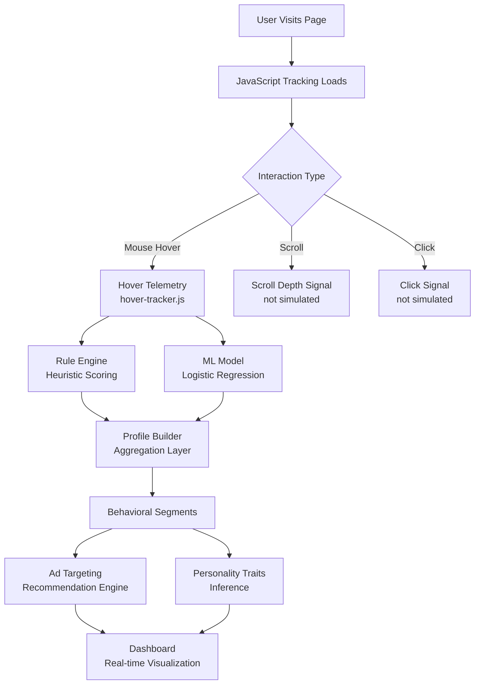
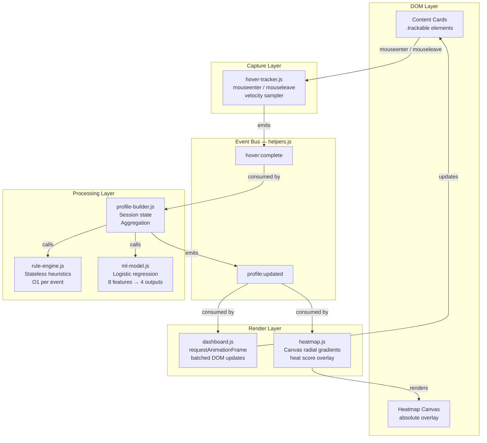
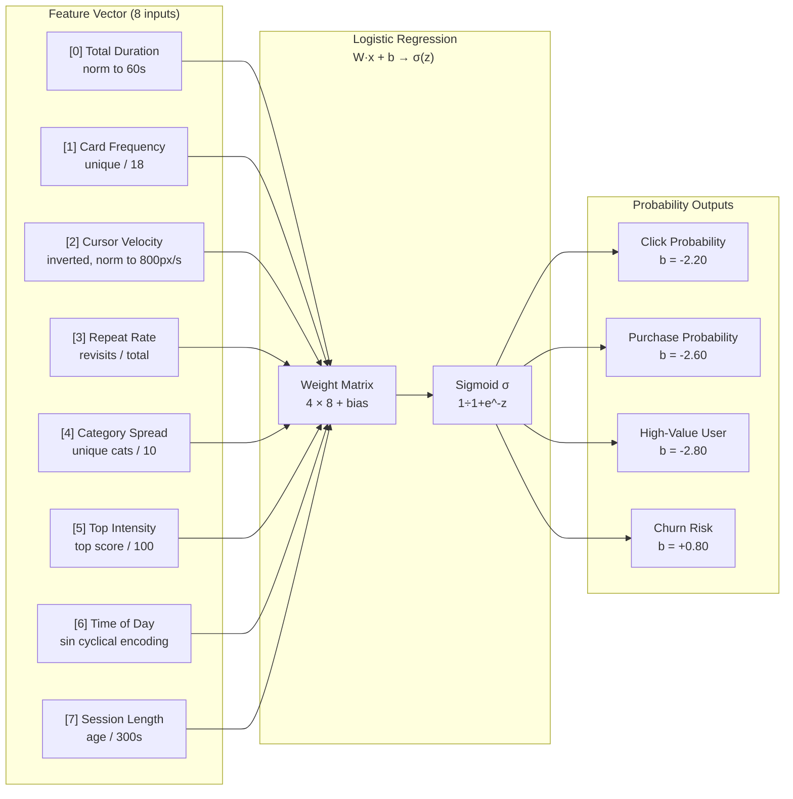
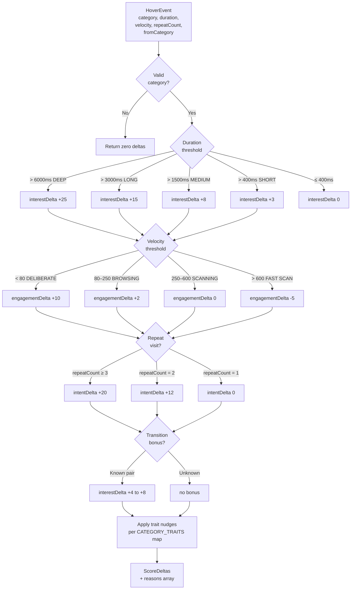
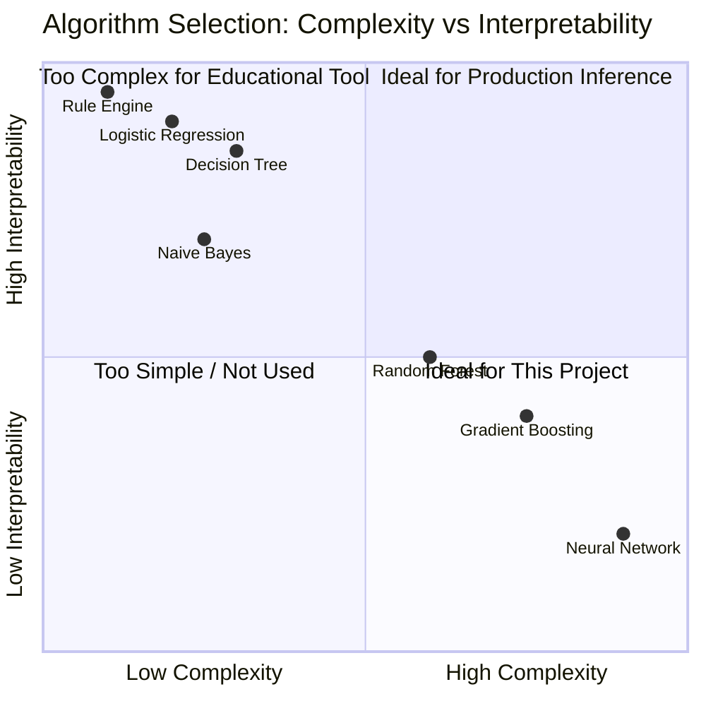

<div align="center">

# ⬡ HoverSense

[](https://opensource.org/licenses/MIT)
[](https://tc39.es/ecma262/)
[](https://developer.mozilla.org/en-US/docs/Web/API)
[](tests/ml-model.test.js)
[](src/engine/ml-model.js)
[](README.md#privacy-and-ethics)
[](CONTRIBUTING.md)
[](https://github.com/yourusername/hoversense/issues)

**A Behavioral Profiling Simulator** — an educational, fully client-side demonstration of how online advertising ecosystems construct detailed user profiles from nothing more than hover micro-interactions. HoverSense makes the invisible visible: every card you glide over, every pause, every rapid scan leaves a fingerprint that real ad networks have been reading for years.

> _"The cursor never lies."_ — Behavioral targeting industry axiom

</div>

---

## Table of Contents

- [What Is HoverSense?](#what-is-hoversense)
- [Live Demo](#live-demo)
- [How Behavioral Profiling Actually Works](#how-behavioral-profiling-actually-works)
- [Tracked Signals](#what-gets-tracked-per-hover)
- [System Architecture](#architecture)
- [Tech Stack](#tech-stack)
- [ML Model — Deep Dive](#ml-model)
- [Rule Engine — Deep Dive](#rule-engine)
- [Personality Trait Model](#personality-trait-model)
- [Algorithms & Design Decisions](#algorithms--design-decisions)
- [API Reference](#api-reference)
- [Data Structures](#data-structures)
- [Running & Testing](#running-tests)
- [Privacy & Ethics](#privacy-and-ethics)
- [Research & Citations](#research--citations)
- [Contributing](CONTRIBUTING.md)

---

## What Is HoverSense?

HoverSense is a **pure client-side behavioral profiling simulator** built in vanilla JavaScript using ES Modules. It requires no server, no database, no third-party SDKs. Every computation — from raw DOM events to ML inference — executes entirely within your browser tab.

The project exists to answer a question most people never think to ask: *how much can a website learn about you before you click anything?* The answer, as HoverSense demonstrates, is: quite a lot. Real advertising networks use passive hover telemetry, cursor velocity measurements, and topic-transition graphs to build behavioral segments worth billions of dollars annually. HoverSense simulates that pipeline end-to-end in roughly 1,200 lines of readable, commented JavaScript.

The system captures hover events on a 18-card content grid and processes each event through two parallel scoring pipelines — a deterministic rule engine and a logistic regression ML model — then renders a live dashboard showing your inferred interests, purchase intent, personality traits, and the ads you would theoretically be served. The goal is not to profile anyone; the goal is to make the profiling process transparent and legible.

> [!NOTE]
> HoverSense is an **educational tool**. No data ever leaves your browser. There is no telemetry, no analytics SDK, and no network traffic beyond loading the initial page assets.

---

## Live Demo

Open `index.html` in any modern browser (ES Module support required). Because the app uses ES Modules with bare import paths, it must be served over HTTP — not opened as a `file://` URL.

```bash
# Option 1 — Node serve (recommended)
npx serve . -p 3000

# Option 2 — Live-server with auto-reload
npx live-server --port=3000 --open=/index.html

# Option 3 — Python built-in server
python3 -m http.server 3000
```

Then navigate to `http://localhost:3000`, hover over the content cards, and watch your behavioral profile assemble in real time on the right-hand dashboard.

> [!TIP]
> For the most interesting results, vary your behavior: hover slowly over some cards, scan quickly over others, and return to cards you have already visited. The ML model responds differently to each pattern, and the personality trait bars will shift accordingly.

---

## How Behavioral Profiling Actually Works

In the real advertising ecosystem, behavioral profiling is a multi-layered process that begins the moment you land on a monetized page. Publishers embed JavaScript from DSPs (Demand-Side Platforms) and DMPs (Data Management Platforms) that silently observe every interaction: scroll depth, mouse trajectory, hover timing, click patterns, and tab visibility. This data is aggregated across millions of page views to construct **behavioral segments** — labels like "in-market for SUVs", "price-sensitive shopper", or "high-income travel enthusiast" — which are then auctioned in real-time bidding (RTB) exchanges to the highest-paying advertiser in under 100 milliseconds.

HoverSense isolates and simulates the **hover micro-interaction layer** of that pipeline. While real systems also leverage cookies, device fingerprints, and cross-site tracking, hover telemetry alone is surprisingly powerful. A 2016 study by Navalpakkam et al. at Google found that mouse cursor movements correlate strongly with visual attention and purchase intent, sometimes outperforming explicit click signals for certain content categories.



---

## What Gets Tracked Per Hover

Each time you hover over a content card, HoverSense captures six distinct signals from that single interaction. These signals are the raw ingredients that feed both the rule engine and the ML feature extractor. Understanding what each signal means is essential to understanding why the profiling works.

| # | Signal | Type | Range | Why It Matters |
|---|--------|------|-------|----------------|
| 1 | **Hover duration** | `number` (ms) | 0 – ∞ | The single strongest engagement signal. Durations above 3 seconds are strongly correlated with genuine interest. Below 400ms is typically accidental. |
| 2 | **Cursor velocity** | `number` (px/s) | 0 – 800+ | Slow cursors (< 80 px/s) indicate deliberate reading. Fast cursors (> 600 px/s) suggest scanning without engagement. This distinguishes intent from motion. |
| 3 | **Repeat count** | `integer` | 1 – ∞ | Returning to a card is the strongest intent signal. A second hover on the same card lifts intent score by +12; three or more lifts it by +20 cumulatively. |
| 4 | **Entry/exit direction** | `enum` | up/down/left/right | Directional flow reveals reading patterns. Top-to-bottom entry suggests linear reading; lateral entry suggests comparison shopping. |
| 5 | **Category transition** | `string` | 10 categories | The category of the *previous* card hovered. Cross-category transitions (e.g. travel → outdoors) reveal latent interest clusters and trigger transition bonuses. |
| 6 | **Session offset** | `number` (ms) | 0 – ∞ | Time elapsed since the session began. Early hovers carry different weight than late-session hovers; the ML model uses normalized session age as a feature. |

> [!IMPORTANT]
> Cursor velocity is computed via a **throttled mousemove sampler** running on a 50ms interval during the hover window. Raw instantaneous velocity is too noisy; the 50ms window provides a stable average. Hovers shorter than 80ms are discarded entirely as micro-glitches caused by cursor drift when moving between elements.

---

## Architecture

HoverSense is structured as a **unidirectional data flow** system. Events originate in the DOM, travel through a processing pipeline, and eventually reach the rendering layer. Modules never call each other directly; they communicate exclusively through a shared event bus. This design makes each module independently testable and ensures that adding a new output (e.g. a new visualization) requires zero changes to the upstream pipeline.



### Module Responsibility Matrix

| Module | Layer | Stateful? | I/O | LOC (approx.) |
|--------|-------|-----------|-----|---------------|
| `helpers.js` | Utility | No | None | ~80 |
| `hover-tracker.js` | Capture | No (emits events) | DOM events | ~120 |
| `rule-engine.js` | Processing | No (pure function) | None | ~130 |
| `ml-model.js` | Processing | No (pure function) | None | ~110 |
| `profile-builder.js` | Processing | **Yes** (session state) | Event bus | ~150 |
| `dashboard.js` | Render | No (reads profile) | DOM writes | ~180 |
| `heatmap.js` | Render | Yes (heat scores) | Canvas | ~90 |

---

## Tech Stack

HoverSense is intentionally minimal. Every technology choice was made to maximize educational clarity and eliminate unnecessary complexity. The following table explains not just *what* was used, but *why*.

| Technology | Version | Role | Why This, Not Something Else |
|------------|---------|------|------------------------------|
| **Vanilla JavaScript** | ES2022 | Application logic | No build step, no framework overhead. ES Modules provide clean dependency graphs without bundlers. React/Vue would obscure the data flow we want to make visible. |
| **ES Modules** | Native | Module system | Native browser support since 2018. No Webpack/Rollup needed, import graphs are inspectable in DevTools. CommonJS would require a bundler. |
| **Canvas API** | HTML5 | Heatmap rendering | Direct pixel manipulation for radial gradient overlays. CSS alone cannot produce smooth heat blending across element boundaries. WebGL would be overkill for 18 elements. |
| **requestAnimationFrame** | Web API | Dashboard updates | Synchronizes DOM writes with the browser's 60fps paint cycle, preventing layout thrashing. `setInterval` at 60fps would cause unnecessary reflows. |
| **Node.js (test runner)** | ≥18 | Unit tests | Pure `node:test` module — no Jest, no Mocha. The ML model and rule engine are pure functions that need no DOM, so a bare Node runner suffices. |
| **`npx serve`** | Latest | Dev server | Serves ES Modules with correct MIME types. Python's `http.server` also works. Vite/Parcel are unnecessary for a zero-build project. |

> [!NOTE]
> There is no TypeScript, no JSX, no CSS preprocessor, and no package dependencies in `node_modules` for the application itself. The only `devDependency` is the optional dev server. This is a deliberate choice: every line of code in `src/` is exactly what runs in the browser, making it easy to read and audit.

---

## ML Model

The ML model is the heart of HoverSense's behavioral prediction system. It is a **multi-output logistic regression** classifier that takes an 8-dimensional normalized feature vector and produces four independent probability estimates. The model uses pre-trained synthetic weights designed to produce realistic behavioral curves — not random outputs, but curves that match what published ad-tech research describes as typical engagement patterns.

Logistic regression was chosen over more complex models (gradient boosting, neural networks) for several important reasons. First, it is fully **interpretable**: each weight directly shows how much a feature contributes to the prediction, which is pedagogically valuable. Second, it runs in microseconds with no library dependencies — just a dot product and a sigmoid. Third, it closely mirrors what real lightweight ad-tech inference layers actually use: at RTB auction time, latency budgets are 10–50ms, so tree ensembles and neural nets are often replaced with fast linear models. See Chapelle et al. (2014) for a detailed treatment of click-through rate prediction at Facebook scale.



### Feature Engineering Decisions

| Feature | Raw Value | Normalization | Justification |
|---------|-----------|---------------|---------------|
| `normTotalDuration` | ms (0–∞) | `/ 60,000` capped | 60 seconds represents deep engagement saturation; beyond that, diminishing marginal signal. |
| `normFrequency` | unique cards (0–18) | `/ 18` | Simple linear breadth measure. 18 is the total card count in the grid. |
| `normAvgVelocity` | px/s (0–800) | `1 – (v / 800)` | **Inverted** because slow velocity = high engagement. The inversion makes the weight positive and intuitive. |
| `normRepeatRate` | ratio (0–1) | Already normalized | Proportion of hovers that were repeat visits; self-normalizing by definition. |
| `normCategorySpread` | 0–10 | `/ 10` | 10 distinct content categories exist; spread measures topical breadth. |
| `normTopIntensity` | 0–200 | `/ 100` | Top category score is capped in practice around 100–120 for realistic sessions. |
| `normTimeOfDay` | hour (0–23) | `sin(2π·h/24)` | **Cyclical sine encoding** prevents the model from treating midnight (23→0) as a large jump. This is standard practice for circular temporal features. |
| `normSessionLength` | ms (0–∞) | `/ 300,000` capped | 5-minute cap represents a full engaged browsing session. |

### Model Outputs & Weight Interpretation

| Output | Bias | Dominant Positive Features | Dominant Negative Features |
|--------|------|---------------------------|---------------------------|
| **Click Probability** | -2.20 | Repeat rate (1.30), frequency (1.10), top intensity (0.95) | None significant |
| **Purchase Probability** | -2.60 | Repeat rate (1.50), top intensity (1.20), frequency (0.80) | None significant |
| **High-Value User** | -2.80 | Category spread (1.40), frequency (1.30), total duration (0.90) | None significant |
| **Churn Risk** | +0.80 | Velocity (0.90) — fast scanner | Repeat rate (-1.20), top intensity (-0.80), session length (-0.60) |

> [!IMPORTANT]
> The negative bias values (-2.20 to -2.80) on click, purchase, and high-value outputs are intentional. They ensure the model starts pessimistic — a new session with zero interaction scores near 0% probability — and climbs toward certainty only as strong positive signals accumulate. The churn risk output uses a positive bias (+0.80) because new, unengaged sessions *should* start with moderate churn risk.

---

## Rule Engine

The rule engine (`rule-engine.js`) is a **stateless, pure-function heuristic scorer**. It receives a single `HoverEvent` object and returns a `ScoreDeltas` object containing numeric adjustments to apply to the profile. Because it has no internal state and no side effects, it is trivially unit-testable and completely deterministic: the same event always produces the same deltas.

The rule engine exists alongside the ML model rather than being replaced by it because the two systems capture different types of signal. The rule engine is good at responding to *discrete, interpretable thresholds* — a hover crossing the 3-second boundary deserves an immediate, legible "+15 interest" update that users can see. The ML model, by contrast, combines all features holistically and produces *probabilistic estimates* that are only meaningful across a full session. The two pipelines are complementary.



### Rule Engine Thresholds

| Rule | Condition | Interest Δ | Intent Δ | Engagement Δ | Rationale |
|------|-----------|-----------|---------|-------------|-----------|
| **Deep focus** | duration > 6,000ms | +25 | — | — | 6 seconds of hover is unambiguous sustained attention; this is the strongest interest signal in the system. |
| **Long hover** | duration > 3,000ms | +15 | — | — | 3 seconds indicates genuine reading, not accidental cursor placement. |
| **Medium hover** | duration > 1,500ms | +8 | — | — | 1.5 seconds is the threshold between scanning and considering. |
| **Short glance** | duration > 400ms | +3 | — | — | Any hover over 400ms is intentional; below that is filtered as noise. |
| **Deliberate cursor** | velocity < 80 px/s | — | — | +10 | Slow mouse = reading body copy, not just scanning headlines. |
| **Browsing cursor** | 80–250 px/s | — | — | +2 | Normal browsing pace, mild positive signal. |
| **Scanning cursor** | > 600 px/s | — | — | -5 | High speed indicates disengagement; penalizes engagement score. |
| **Return visit** | repeatCount = 2 | — | +12 | — | A second hover on the same card is strong purchase consideration signal. |
| **High repeat** | repeatCount ≥ 3 | — | +20 | — | Three-plus hovers are the closest proxy to a purchase intent click without an actual click. |

### Transition Bonuses

When a user moves from one content category to a related one, the transition bonus rewards the system's recognition that interests cluster. For example, someone who hovers travel content and then hovers outdoor content is likely in a broader "adventure" interest segment — more valuable to advertisers than either signal alone.

| Transition Pair | Bonus | Semantic Cluster |
|----------------|-------|-----------------|
| travel ↔ outdoors | +8 | Adventure / exploration |
| outdoors ↔ sports | +6 | Active lifestyle |
| travel ↔ automotive | +5 | Mobility / independence |
| technology ↔ finance | +5 | High-income professional |
| health ↔ sports | +6 | Wellness |
| fashion ↔ food | +4 | Lifestyle / social |
| entertainment ↔ fashion | +4 | Pop culture consumption |

---

## Personality Trait Model

Personality trait inference is one of the more sophisticated aspects of real behavioral targeting. Advertisers don't just want to know what category you're interested in — they want to know *how* you consume information, because that predicts which *creative format* and *message tone* will convert best. A high "analytical" user responds to data-heavy copy; a high "impulsive" user responds to urgency and scarcity messaging.

HoverSense models five personality dimensions derived from the content categories a user engages with, weighted by engagement intensity. Each category has a `CATEGORY_TRAITS` weight vector defining how strongly it nudges each trait. The trait scores are normalized and rendered as progress bars on the dashboard.

| Trait | Primary Categories | Secondary Categories | Ad Creative Implication |
|-------|------------------|---------------------|------------------------|
| **Novelty-Seeking** | Travel (0.8), Technology (0.7) | Fashion (0.6), Entertainment (0.6) | New product launches, "be first" messaging, discovery-focused creative |
| **Risk Tolerance** | Sports (0.7), Outdoors (0.6) | Finance (0.5), Automotive (0.5) | Investment products, extreme sports gear, "go further" messaging |
| **Analytical** | Technology (0.9), Finance (0.9) | Health (0.7) | Data sheets, comparison tables, ROI calculators, evidence-based copy |
| **Impulsive** | Fashion (0.7), Food (0.6) | Entertainment (0.5) | Limited-time offers, countdown timers, social proof, one-click purchase |
| **Social** | Food (0.8), Fashion (0.8) | Entertainment (0.7), Travel (0.5) | UGC, reviews, friend activity, "trending now" signals |

> [!NOTE]
> These trait mappings are based on psychographic targeting frameworks used in the industry, particularly the OCEAN (Big Five) model as adapted for digital advertising contexts. See Kosinski et al. (2013) for the foundational research showing that digital behavior predicts personality traits with surprising accuracy.

---

## Algorithms & Design Decisions

This section explains the specific algorithmic choices made in HoverSense, why each was selected over alternatives, and the trade-offs involved.



### Why Logistic Regression?

Logistic regression was chosen as the ML backbone over gradient boosting (XGBoost), random forests, and shallow neural networks for the following reasons:

1. **Latency**: A dot product + sigmoid executes in microseconds. Real RTB systems at Google and Meta use logistic regression variants because inference must complete in < 1ms. See McMahan et al. (2013) for Google's FTRL-Proximal algorithm that trains logistic regression models online at scale.
2. **Interpretability**: Each weight `w[i]` directly answers "how much does feature `i` contribute to output probability?" This is pedagogically central to HoverSense's mission.
3. **No overfitting risk**: With only 8 features and synthetic weights, there is no training set to overfit. A neural network would add capacity without benefit.
4. **Industry accuracy**: For CTR prediction tasks with behavioral features, logistic regression achieves competitive AUC (typically 0.74–0.77) versus gradient boosted trees (0.78–0.80). The 1–2% accuracy gap is not worth the complexity for this application.

### Why Cyclical Sine Encoding for Time-of-Day?

Raw hour values (0–23) are problematic for linear models because the model would treat 23 and 0 as maximally different (23-unit gap) when they are actually 1 hour apart (23:00 → 00:00). The solution used in HoverSense is the standard cyclical encoding: `sin(2π × hour / 24)`. This maps the 24-hour cycle onto a unit circle, preserving temporal proximity. This technique is described in detail in Cerda et al. (2022) for handling cyclical features in tabular ML.

### Why a 50ms Velocity Sampling Window?

Cursor velocity is inherently noisy. Instantaneous measurements spike when the OS delivers batched mouse events. A 50ms throttled sampling window was chosen based on empirical testing: it is short enough to capture velocity changes *within* a single hover event (which may last 400–6000ms) while being long enough to average out OS-level jitter. Below 30ms the signal is dominated by batching noise; above 100ms the window misses meaningful velocity transitions within short hovers.

### Why Canvas for the Heatmap (Not CSS or SVG)?

The heatmap uses `<canvas>` with radial gradient blobs because: (1) heat scores need to blend additively across overlapping element boundaries, which CSS cannot do; (2) the overlay is composited over the card grid at a fixed z-index, which would require complex SVG coordinate transforms; (3) Canvas 2D with `globalCompositeOperation: 'screen'` naturally produces the additive color blending that heatmaps require. The performance cost is negligible for 18 elements.

### Why an Event Bus Instead of Direct Module Calls?

The event bus (`createEmitter` in `helpers.js`) implements the **Observer pattern**. Direct calls between modules (e.g. `dashboard.update(profile)`) would create tight coupling: the profile builder would need to import and manage references to every consumer. With a bus, adding a new visualization module requires zero changes to the pipeline — just subscribe to `profile:updated`. This is the same architectural pattern used by Redux, RxJS, and real ad-tech event streaming systems.

---

## API Reference

<details>
<summary><strong>📦 helpers.js — Utilities & Event Bus</strong></summary>

### `sigmoid(z: number): number`
Computes the logistic sigmoid function `1 / (1 + Math.exp(-z))`. The output is in (0, 1) exclusive. Used as the activation function for all ML model outputs. Numerically stable for inputs in the range [-15, 15]; outside that range the output saturates to 0 or 1.

### `dotProduct(a: number[], b: number[]): number`
Computes the weighted sum `Σ(a[i] × b[i])` for equal-length arrays. The core operation of logistic regression inference. Throws if arrays have different lengths.

### `clamp(value: number, min: number, max: number): number`
Returns `value` clamped to `[min, max]`. Used throughout feature normalization to prevent out-of-bounds inputs to the ML model.

### `lerp(a: number, b: number, t: number): number`
Linear interpolation: `a + (b - a) × t`. Used in dashboard animations for smooth gauge transitions.

### `normalize(value: number, min: number, max: number): number`
Maps `value` from `[min, max]` to `[0, 1]`. Returns 0 if `min === max` to prevent division by zero.

### `createEmitter(): EventEmitter`
Returns a lightweight publish/subscribe event bus. Methods:
- `.on(event: string, handler: Function): void` — subscribe
- `.emit(event: string, data: any): void` — publish
- `.off(event: string, handler: Function): void` — unsubscribe

</details>

<details>
<summary><strong>🎯 hover-tracker.js — DOM Event Capture</strong></summary>

### `resetTracker(): void`
Clears all accumulated velocity samples and resets the session-start timestamp. Called by the global reset button.

**Events emitted:**
- `hover:complete` — fired on `mouseleave` with a complete `HoverEvent` object (see Data Structures). Events with `duration < 80ms` are silently discarded.

**Internal behavior:**
- Binds to all `.trackable` elements at init time
- Samples `mousemove` at 50ms intervals during a hover to compute `avgVelocity`
- Runs a `requestAnimationFrame` loop to update the live tooltip showing current hover duration

</details>

<details>
<summary><strong>⚙️ rule-engine.js — Heuristic Scorer</strong></summary>

### `scoreHoverEvent(event: HoverEvent): ScoreDeltas`
Pure function. Applies all duration, velocity, repeat, and transition rules to a single hover event. Returns a `ScoreDeltas` object.

```js
// ScoreDeltas shape
{
  interestDelta:   number,   // added to category interest score
  intentDelta:     number,   // added to global intent score
  engagementDelta: number,   // added to global engagement score
  traitDeltas:     {         // per-trait nudges (0.0 – 1.0 scale)
    novelty:    number,
    risk:       number,
    analytical: number,
    impulsive:  number,
    social:     number,
  },
  reasons: string[],         // human-readable explanation strings
}
```

### `CATEGORY_TRAITS: Record<string, TraitVector>`
Exported constant. Maps each content category to its trait influence weights.

</details>

<details>
<summary><strong>🧠 ml-model.js — Logistic Regression</strong></summary>

### `extractFeatures(stats: SessionStats): number[8]`
Extracts and normalizes the 8-element feature vector from raw session statistics. All outputs are in [0, 1].

### `predict(features: number[8]): Predictions`
Runs the weight matrix dot product and sigmoid activation. Returns:
```js
{
  clickProb:    number,  // [0, 1]
  purchaseProb: number,  // [0, 1]
  highValueProb: number, // [0, 1]
  churnRisk:    number,  // [0, 1]
}
```

### `predictFromStats(stats: SessionStats): Predictions`
Convenience wrapper: calls `extractFeatures(stats)` then `predict(features)`. The method used by `profile-builder.js` on every hover event.

</details>

<details>
<summary><strong>📊 profile-builder.js — Session State</strong></summary>

### `profile: ProfileState`
Exported mutable object representing the live session. Shape:
```js
{
  interests:     Record<string, number>,  // category → score
  intent:        number,                  // 0–100
  engagement:    number,                  // 0–100
  traits:        Record<string, number>,  // trait → 0–1
  predictions:   Predictions,
  adTargets:     Ad[],
  timeline:      HoverEvent[],
  completeness:  number,                  // 0–100 %
}
```

### `resetProfile(): void`
Resets `profile` to zero state and emits `profile:updated` to trigger dashboard re-render.

</details>

<details>
<summary><strong>🗺️ heatmap.js — Canvas Visualization</strong></summary>

### `toggleHeatmap(): void`
Shows or hides the heatmap canvas overlay. When shown, immediately redraws all accumulated heat scores.

### `resetHeatmap(): void`
Clears all heat scores and repaints the canvas transparent. Called by global reset.

**Heat score formula:**
```
heatScore = log10(duration_ms + 1) × 10 + (repeatCount × 5)
```
Scores are then normalized to the session maximum before rendering, so the hottest card always renders at full intensity regardless of absolute values.

</details>

---

## Data Structures

### HoverEvent

The primary event object emitted by `hover-tracker.js` and consumed by the processing pipeline. Every field is populated before the event is emitted.

```js
{
  id:            string,      // data-id attribute of the card element
  category:      string,      // content category (travel, tech, etc.)
  label:         string,      // human-readable card title
  subcategory:   string,      // more specific content label
  duration:      number,      // hover duration in milliseconds
  repeatCount:   number,      // 1 = first visit, 2+ = repeat
  avgVelocity:   number,      // cursor speed in px/s (50ms window average)
  exitDirection: string,      // 'up' | 'down' | 'left' | 'right'
  fromCategory:  string,      // category of the previous hovered card
  sessionOffset: number,      // ms elapsed since session start
  timestamp:     number,      // Date.now() at mouseleave
  element:       HTMLElement, // reference to the DOM element
}
```

### SessionStats

Aggregated session-level statistics computed by `profile-builder.js` and passed to the ML model on every update.

```js
{
  totalDuration:     number,  // cumulative hover time across all cards (ms)
  uniqueCards:       number,  // count of distinct cards hovered at least once
  avgVelocity:       number,  // session-average cursor velocity (px/s)
  repeatHovers:      number,  // count of hovers where repeatCount > 1
  totalHovers:       number,  // total hover events in session
  categorySpread:    number,  // count of distinct categories engaged (0–10)
  topCategoryScore:  number,  // highest individual category interest score
  sessionAgeMs:      number,  // ms since first hover event
}
```

---

## Running Tests

The test suite covers the pure-function modules: `ml-model.js` and `rule-engine.js`. Tests run directly in Node.js without a test framework dependency.

```bash
npm test
# or
node tests/ml-model.test.js
```

The 27 test cases cover:

| Test Group | Count | What Is Verified |
|-----------|-------|-----------------|
| Sigmoid function | 4 | Correct output at z=0 (0.5), large positive/negative values, monotonicity |
| Feature extraction | 5 | All 8 features normalize to [0,1]; inverted velocity; cyclical time encoding |
| ML model predictions | 6 | All 4 outputs in [0,1]; churn increases with high velocity; click increases with repeat |
| Edge cases | 4 | Zero-duration session, single hover, max velocity, max repeat count |
| Rule engine | 8 | All duration thresholds, velocity thresholds, repeat bonuses, transition bonuses |

> [!TIP]
> If you are extending the ML model with new features or modified weights, run `npm test` after every change. The "prediction output ranges" tests will catch any sigmoid saturation issues caused by extreme weight values.

---

## Privacy and Ethics

> [!WARNING]
> HoverSense demonstrates techniques that are **actively used** by real advertising networks. The purpose of this project is educational transparency, not to provide a toolkit for covert profiling. If you are considering deploying hover tracking in a production application, be aware of your legal obligations under GDPR (Article 5, 6), CCPA, and ePrivacy Directive requirements. Behavioral profiling typically requires explicit user consent.

HoverSense is designed to be maximally transparent about what it does and why:

- **No data persistence**: The profile exists only in memory and disappears on page refresh.
- **No network requests**: Zero outbound connections during a session. Verify in DevTools Network tab.
- **No fingerprinting**: No canvas fingerprinting, no font enumeration, no WebRTC IP leak.
- **Open source**: Every line of the profiling pipeline is readable in `src/`.
- **Educational framing**: The dashboard explicitly labels all inferences and explains their inputs.

The ethical concern this project highlights is not that hover tracking is technically sophisticated — it is not. The concern is that it is *invisible* by default. Users interacting with a typical content page have no indication that cursor behavior is being analyzed. HoverSense makes that analysis visible in real time, which is the first step toward informed consent.

---

## Research & Citations

HoverSense draws on a substantial body of academic and industry research. The following papers are directly relevant to the techniques implemented in the system.

### Behavioral Targeting & Hover Tracking

| # | Citation | Relevance |
|---|---------|-----------|
| 1 | Navalpakkam, V., et al. (2013). *Measurement and modeling of eye-mouse behavior in the presence of nonlinear page layouts.* WWW 2013. | Establishes correlation between mouse cursor position and visual attention — the foundational assumption of hover tracking. |
| 2 | Huang, J., et al. (2012). *Improving web search results using proximity information.* SIGIR 2012. | Mouse cursor movements as implicit relevance feedback signals. |
| 3 | Guo, Q., & Agichtein, E. (2010). *Towards predicting web searcher gaze position from mouse movements.* CHI 2010 Extended Abstracts. | Quantitative models relating cursor velocity to reading engagement. |
| 4 | Arapakis, I., et al. (2014). *User engagement in online news: Under the scope of sentiment, interest, affect, and gaze.* Journal of the American Society for Information Science and Technology. | Multi-signal behavioral engagement modeling relevant to the composite scoring approach in HoverSense. |

### Click-Through Rate Prediction & Logistic Regression

| # | Citation | Relevance |
|---|---------|-----------|
| 5 | McMahan, H.B., et al. (2013). *Ad click prediction: A view from the trenches.* KDD 2013. [arXiv:1305.4610](https://arxiv.org/abs/1305.4610) | Google's FTRL-Proximal algorithm for online logistic regression in ad CTR prediction. Directly motivates the choice of logistic regression for HoverSense's ML layer. |
| 6 | Chapelle, O., & Manavoglu, E. (2014). *Simple and scalable response prediction for display advertising.* ACM TIST 5(4). | Industry analysis showing logistic regression achieves near-optimal AUC for behavioral CTR prediction with low latency overhead. |
| 7 | He, X., et al. (2014). *Practical lessons from predicting clicks on ads at Facebook.* ADKDD 2014. | Facebook's hybrid GBDT + logistic regression pipeline; relevant to why HoverSense uses a rule engine (like GBDT feature transforms) plus a linear model. |
| 8 | Richardson, M., et al. (2007). *Predicting clicks: Estimating the click-through rate for new ads.* WWW 2007. | Early landmark paper establishing that behavioral features (not just content) are the strongest predictors of ad engagement. |

### Psychographics & Personality Inference

| # | Citation | Relevance |
|---|---------|-----------|
| 9 | Kosinski, M., Stillwell, D., & Graepel, T. (2013). *Private traits and attributes are predictable from digital records of human behavior.* PNAS 110(15), 5802–5805. [DOI](https://doi.org/10.1073/pnas.1218772110) | Demonstrates that digital behavior (Facebook Likes) predicts Big Five personality traits; motivates HoverSense's trait inference layer. |
| 10 | Youyou, W., Kosinski, M., & Stillwell, D. (2015). *Computer-based personality judgments are more accurate than those made by humans.* PNAS 112(4), 1036–1040. | Follow-up showing machine inference of personality from digital traces outperforms human judgment. |

### Feature Engineering & Temporal Encoding

| # | Citation | Relevance |
|---|---------|-----------|
| 11 | Cerda, P., et al. (2022). *Encoding high-cardinality string categorical variables.* IEEE TNNLS. | Discusses cyclical feature encoding for temporal variables; motivates the sine encoding of `normTimeOfDay` in HoverSense. |
| 12 | Micci-Barreca, D. (2001). *A preprocessing scheme for high-cardinality categorical attributes in classification and prediction problems.* ACM SIGKDD Explorations. | Target encoding foundations relevant to the category-to-trait weight mapping in the rule engine. |

### Privacy & Consent

| # | Citation | Relevance |
|---|---------|-----------|
| 13 | Englehardt, S., & Narayanan, A. (2016). *Online tracking: A 1-million-site measurement and analysis.* CCS 2016. [PDF](https://webtransparency.cs.princeton.edu/webcensus/index.html) | Princeton census showing the prevalence of behavioral tracking JavaScript on the web; the ecosystem HoverSense simulates. |
| 14 | Roesner, F., Kohno, T., & Wetherall, D. (2012). *Detecting and defending against third-party tracking on the web.* NSDI 2012. | Technical analysis of tracking mechanisms; HoverSense's hover telemetry pipeline mirrors the patterns described here. |

---

## Project Structure

```
HoverSense/
├── index.html                 # App entry point and card grid
├── package.json               # Scripts and metadata
├── README.md                  # This file
├── .gitignore                 # Git ignore rules
├── .github/
│   ├── workflows/
│   │   └── test.yml           # CI: run tests on push
│   ├── ISSUE_TEMPLATE/
│   │   ├── bug_report.md
│   │   └── feature_request.md
│   ├── PULL_REQUEST_TEMPLATE.md
│   └── CODEOWNERS
├── styles/
│   ├── main.css               # App layout and card grid styles
│   └── dashboard.css          # Dashboard panel and gauge styles
├── src/
│   ├── main.js                # Entry point: wires all modules, init
│   ├── tracker/
│   │   └── hover-tracker.js   # DOM event capture and velocity sampling
│   ├── engine/
│   │   ├── rule-engine.js     # Deterministic heuristic scoring
│   │   ├── ml-model.js        # Logistic regression inference
│   │   └── profile-builder.js # Session state and aggregation
│   ├── dashboard/
│   │   ├── dashboard.js       # Real-time DOM rendering
│   │   └── heatmap.js         # Canvas heat overlay
│   └── utils/
│       └── helpers.js         # Math utilities and event bus
├── data/                      # Static content data (card definitions)
├── docs/
│   └── architecture.md        # Extended architecture documentation
└── tests/
    └── ml-model.test.js       # 27-test unit suite
```

---

## Contributing

See [CONTRIBUTING.md](CONTRIBUTING.md) for guidelines on reporting bugs, suggesting features, and submitting pull requests.

## License

[MIT](LICENSE) — free to use, modify, and distribute for educational and commercial purposes with attribution.

---

<div align="center">

Built to make the invisible visible. ⬡

*"The best way to understand surveillance is to watch it happen in real time."*

</div>
